# 基于 PSPNet 的 CamVid 城市街景语义分割课程设计报告

---

## 摘要

语义分割旨在对图像中每个像素进行类别预测，是自动驾驶场景理解等任务的关键基础。本报告以 CamVid 城市街景数据集为实验对象，实现并训练 PSPNet（Pyramid Scene Parsing Network）模型，利用 Pyramid Pooling Module 融合多尺度上下文信息以提升像素级解析能力。为确保结论可信，我们提供统一的数据预处理、训练配置与评测指标（mIoU），并支持与基线模型（FCN、DeepLabv3+）在同一评测协议下进行对比。报告给出定量结果、可视化预测对比与典型失败案例分析，讨论多尺度上下文与结构设计对分割性能的影响。

**关键词**：语义分割；PSPNet；CamVid；mIoU；多尺度上下文

---

# 目录

- 第一章 背景介绍
- 第二章 算法原理介绍
- 第三章 程序设计与实现
- 第四章 程序测试与结果分析
- 第五章 结论
- 参考文献
- 附录

---

# 第一章 背景介绍

## 1.1 任务定义与应用

语义分割（Semantic Segmentation）要求对输入图像中每一个像素赋予语义类别标签（如道路、建筑、天空、行人等）。与图像分类输出单一类别不同，语义分割输出与输入等尺寸的像素级预测图，因此对空间细节与边界恢复提出更高要求。在自动驾驶、机器人导航、智能交通等场景中，语义分割可作为场景理解的核心模块，为检测、跟踪与决策规划提供结构化先验。

## 1.2 数据集：CamVid

CamVid 是经典的城市街景语义分割数据集，包含道路场景视频帧与像素级标注。本文采用常用的 11 类设置，并使用 train/val/test 划分（train 367，val 101，test 233）。数据目录结构与加载方式见第三章实现部分。

## 1.3 评测指标：mIoU

本文采用 mean Intersection over Union（mIoU）作为主要评测指标。对每一类 $c$，IoU 定义为：

$$IoU_c = \\frac{TP_c}{TP_c + FP_c + FN_c}$$

其中 $TP/FP/FN$ 分别为该类的真阳性、假阳性与假阴性像素数。mIoU 为各类 IoU 的平均值（忽略未出现的类别）。

---

# 第二章 算法原理介绍

## 2.1 PSPNet 总体结构

PSPNet 的核心思想是在主干网络（backbone）提取的高层语义特征上引入 Pyramid Pooling Module（PPM），以融合不同尺度的上下文信息。整体流程包括：

1. Backbone 提取特征图（本文默认使用 ResNet 系列骨干）
2. PPM 在 {1×1, 2×2, 3×3, 6×6} 多尺度池化下聚合全局/局部上下文
3. 上采样并拼接多尺度特征，经卷积融合后输出逐像素分类结果

## 2.2 Pyramid Pooling Module（PPM）

PPM 对输入特征图执行多分辨率的区域池化，得到不同尺度的上下文向量；每个尺度分支通过 1×1 卷积压缩通道后上采样回原特征图尺寸；最后将各尺度特征与原特征拼接并融合。该结构能在保持局部细节的同时引入全局语义先验，对大场景类别（如道路、天空）与小目标类别（如行人、骑行者）同时建模更有利。

## 2.3 对照模型（可选）

为形成统一对比，本项目实现并支持以下对照模型：

- FCN：经典全卷积分割基线（以 ResNet 为骨干并输出像素级预测）
- DeepLabv3+：基于 ASPP 的多尺度空洞卷积 + decoder 的边界恢复结构

---

# 第三章 程序设计与实现

## 3.1 代码结构

本实验实现位于以下路径：

- 数据集：`src/data/camvid.py`
- 模型：`src/models/pspnet.py`、`src/models/deeplabv3plus.py`
- 训练：`code/segmentation/train_camvid.py`
- 评测与可视化：`code/segmentation/eval_camvid.py`
- 曲线绘制：`code/segmentation/plot_training_curves.py`

## 3.2 数据预处理与增强

训练阶段采用随机缩放、随机裁剪与随机水平翻转；验证/测试阶段进行固定尺寸 resize。标签中 Void 类统一映射为 ignore_index=255，不参与损失与 mIoU 计算。

## 3.3 训练配置

默认训练配置如下（可通过命令行参数调整）：

- Optimizer：SGD (momentum=0.9, weight_decay=1e-4)
- Loss：CrossEntropyLoss(ignore_index=255)
- Input size：crop (360×480)
- Metric：mIoU
- 训练轮数：50 epochs
- 编译加速：默认开启 `torch.compile`

三组对比实验使用相同的学习率与权重衰减（lr=0.01, weight_decay=1e-4），为显存与计算开销考虑，batch size 设为：

- PSPNet：8
- FCN：4
- DeepLabv3+：4

## 3.4 复现实验命令

```bash
# 训练 PSPNet（会在 experiments/segmentation/<run-id>/ 下生成日志与 checkpoint）
pixi run python code/segmentation/train_camvid.py --model pspnet --epochs 50 --batch-size 8

# 生成训练曲线图（保存到 report/figures/segmentation/<run-id>/）
pixi run python code/segmentation/plot_training_curves.py --run-dir experiments/segmentation/<run-id>

# 评测并导出可视化（val/test）
pixi run python code/segmentation/eval_camvid.py --model pspnet --split val \\
  --checkpoint experiments/segmentation/<run-id>/best.pth \\
  --out-dir report/figures/segmentation/<run-id>/eval_pspnet
```

---

# 第四章 程序测试与结果分析

## 4.1 定量结果（mIoU）

本节汇总三组对比实验在 CamVid val 集上的结果（以 best checkpoint 为准）。

| 模型 | Backbone | Input size | mIoU (val) | Best epoch | 备注 |
|---|---|---:|---:|---|
| PSPNet | ResNet-50 | 360×480 | 0.5539 | 27 | 本项目实现 |
| FCN | ResNet-50 | 360×480 | 0.5874 | 49 | torchvision baseline |
| DeepLabv3+ | ResNet-50 | 360×480 | 0.5927 | 34 | 本项目实现 |

可以看到，在本次从零训练配置下：

- DeepLabv3+ 取得最高的 mIoU（0.5927），说明 ASPP 多尺度上下文 + decoder 边界恢复对 CamVid 有明显收益。
- FCN 作为基线表现非常强（0.5874），在小数据集上收敛稳定。
- PSPNet 在本实现与训练策略下略低于 FCN，但仍显著优于烟雾测试结果，且在大类（Sky/Road/Building）上表现良好。

进一步观察 per-class IoU，难点主要集中在小目标类别（Pole、SignSymbol、Pedestrian）。对三种模型的关键类别 IoU 对比如下：

| 类别 | PSPNet IoU | FCN IoU | DeepLabv3+ IoU |
|---|---:|---:|---:|
| Pole | 0.0000 | 0.0121 | 0.0319 |
| SignSymbol | 0.0816 | 0.0869 | 0.1854 |
| Pedestrian | 0.2447 | 0.2549 | 0.2549 |

这表明 DeepLabv3+ 在小目标与边界细节上更占优势，而 PSPNet/FCN 在大区域类别上差距不大。

### 4.1.1 烟雾测试结果（流程连通性验证）

为验证训练-评测-可视化流程可用，我们进行了 1 个 epoch 的 smoke run：

- run id：`smoke-pspnet-20251218`
- checkpoint：`experiments/segmentation/smoke-pspnet-20251218/best.pth`
- val mIoU：`0.1985`
- metrics：`report/figures/segmentation/smoke-pspnet-20251218/eval_pspnet/metrics.json`

该结果仅用于验证流程连通性；正式报告请以更长训练轮数（例如 50/100 epochs）后的结果为准。

## 4.2 训练曲线

训练 loss 与 val mIoU 曲线（由 `plot_training_curves.py` 生成）：

- PSPNet：`figures/segmentation/seg-20251218-pspnet/camvid_loss.png`、`figures/segmentation/seg-20251218-pspnet/camvid_miou.png`
- FCN：`figures/segmentation/seg-20251218-fcn/camvid_loss.png`、`figures/segmentation/seg-20251218-fcn/camvid_miou.png`
- DeepLabv3+：`figures/segmentation/seg-20251218-deeplabv3plus/camvid_loss.png`、`figures/segmentation/seg-20251218-deeplabv3plus/camvid_miou.png`

PSPNet（本次正式实验）曲线：

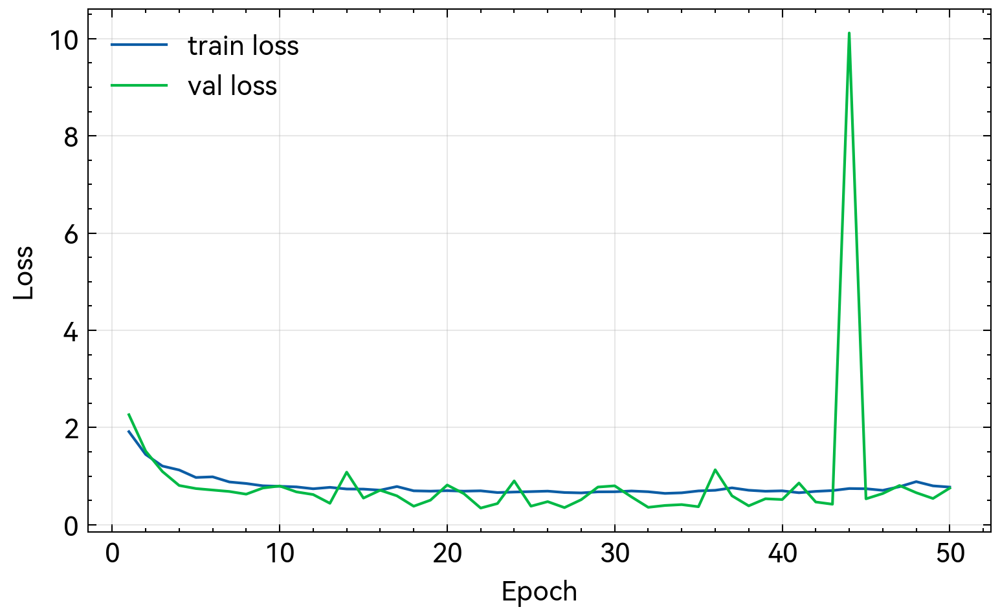

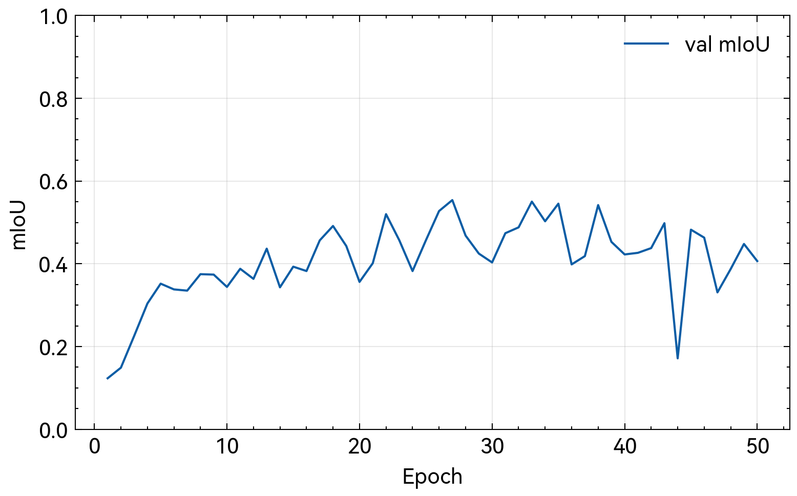

FCN（baseline）曲线：

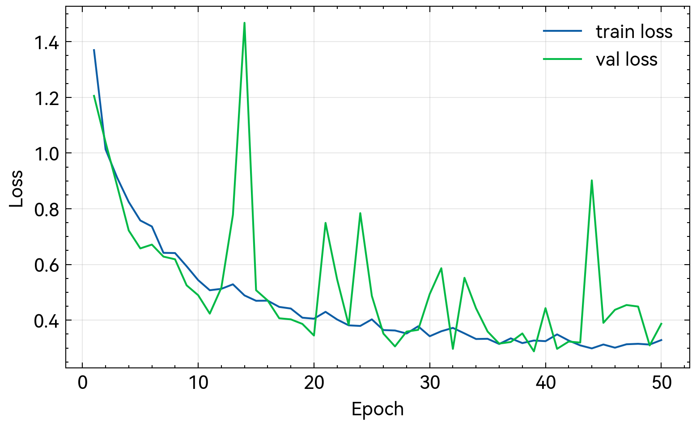

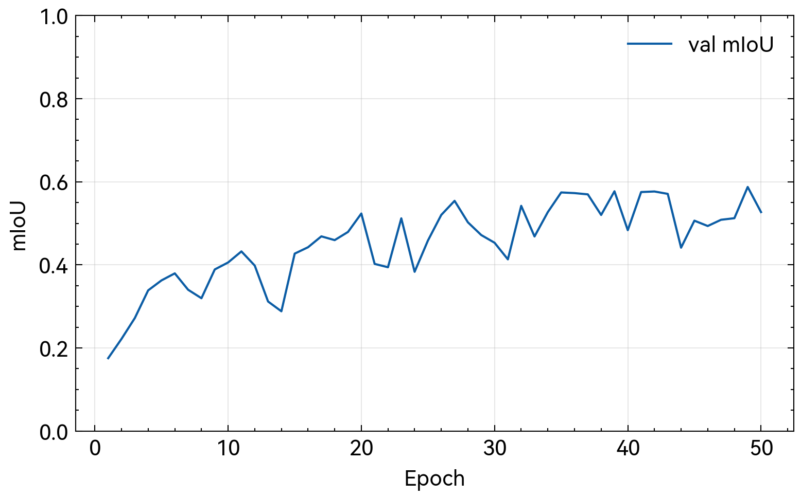

DeepLabv3+（强对照）曲线：

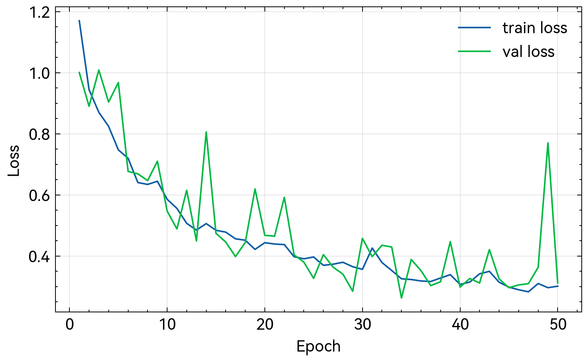

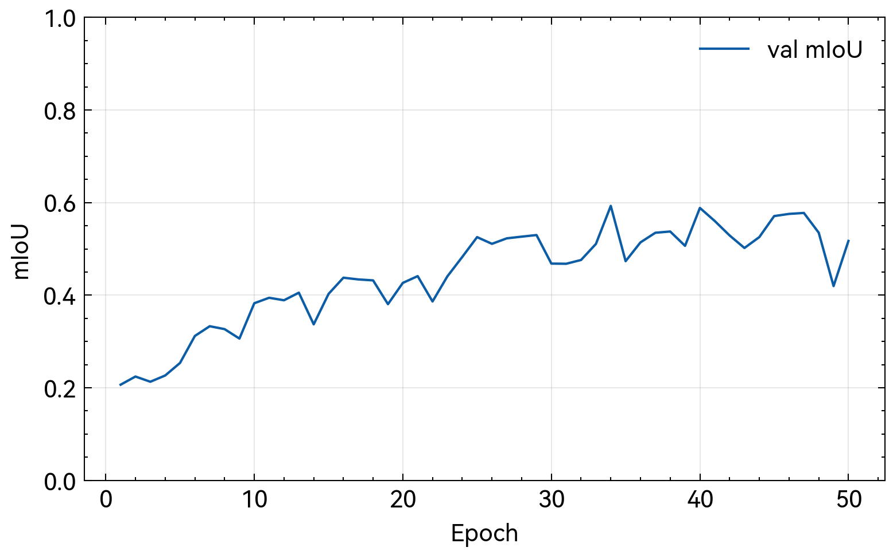

烟雾测试曲线（流程验证）：

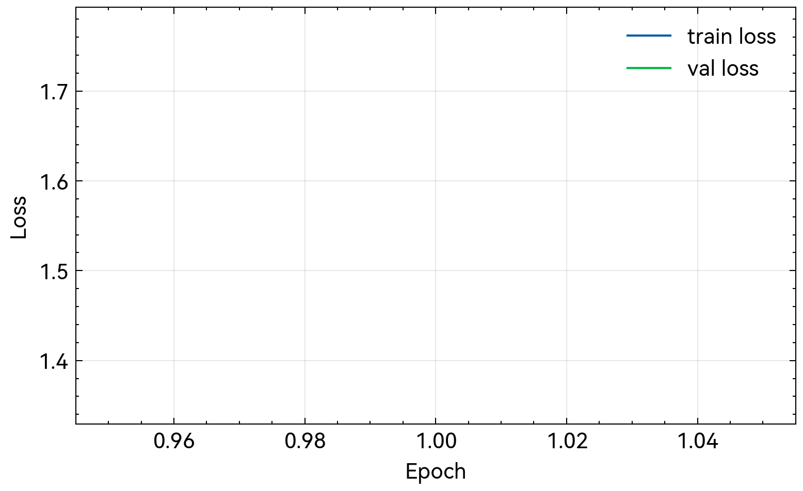

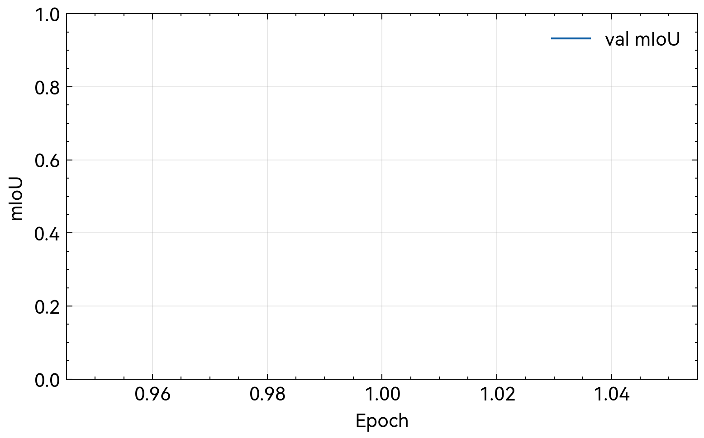

## 4.3 可视化对比

从验证集抽取若干样例，导出输入图、GT 与预测结果的并排对比（由 `eval_camvid.py` 导出）：

- `figures/segmentation/seg-20251218-pspnet/eval_pspnet/vis/`
- `figures/segmentation/seg-20251218-fcn/eval_fcn/vis/`
- `figures/segmentation/seg-20251218-deeplabv3plus/eval_deeplabv3plus/vis/`

以样例 000 为例（输入/GT 为相同图像，仅展示不同模型的预测）：

| 输入 | GT | PSPNet | FCN | DeepLabv3+ |
|---|---|---|---|---|
|  |  | 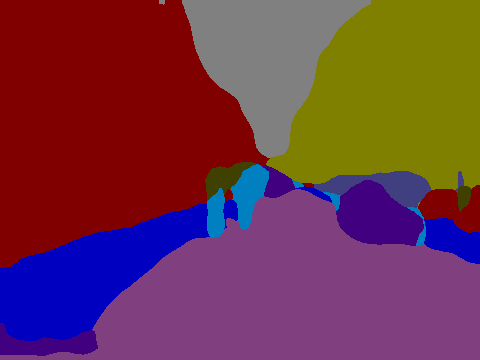 | 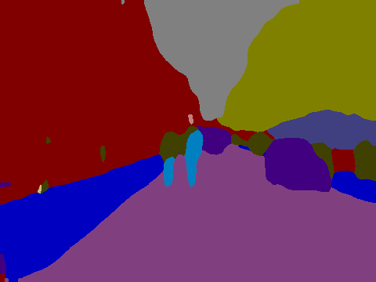 | 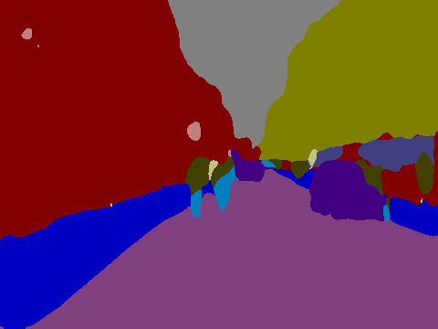 |

烟雾测试可视化示例目录：

- `report/figures/segmentation/smoke-pspnet-20251218/eval_pspnet/vis/`

## 4.4 失败案例分析（示例写法）

从 per-class IoU 可以观察到，三种模型的“难点类别”高度一致：Pole、SignSymbol、Pedestrian 等小目标类别 IoU 较低；而 Sky、Road、Building、Tree 等大区域类别 IoU 较高。这符合 CamVid 场景中类别尺度差异与类别不均衡的特征。

结合可视化结果，典型失败模式包括：

1. **小目标漏检（Pole/SignSymbol）**：目标像素占比极低，且常与背景（建筑/树木）纹理混杂，容易被平滑掉。DeepLabv3+ 在该类上的 IoU 明显高于 PSPNet/FCN，说明 decoder + ASPP 的组合对小目标与边界有更好的恢复能力。
2. **边界模糊（Road/Sidewalk/Fence 交界）**：上采样插值与特征混合导致边界不锐利。DeepLabv3+ 的边界更连贯；PSPNet 预测更偏向大区域一致性。
3. **相似纹理混淆（Tree vs Building/Sign）**：光照变化与遮挡导致纹理与颜色分布相近，错误常集中在边缘区域或遮挡处。

---

# 第五章 结论

本文基于 CamVid 数据集实现了 PSPNet 语义分割系统，提供统一的训练、评测与可视化流程，并支持与 FCN、DeepLabv3+ 等基线进行对比。后续工作可在更长训练轮数、更强 backbone、以及更精细的边界建模（如引入边界损失或更强 decoder）方面进一步提升性能。

---

# 参考文献

（按最终使用的论文与引用格式补全）

---

# 附录

附录可包含：开发日志、成员分工、关键配置、运行截图等。
