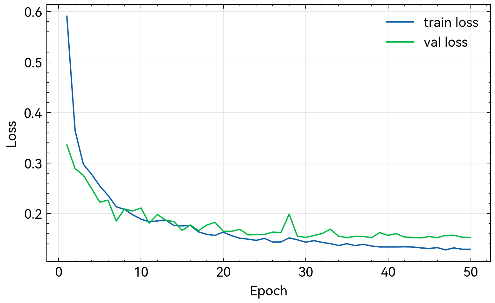
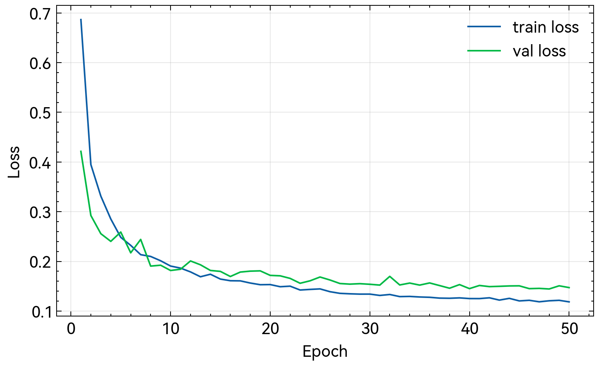

# 基于 PSPNet 的 CamVid 语义分割：实现与对照实验分析

---

## 摘要

语义分割旨在对图像中每个像素进行类别预测，是自动驾驶场景理解等任务的关键基础。本报告以 CamVid 城市街景数据集为实验对象，实现 PSPNet（Pyramid Scene Parsing Network）并完成训练、评测与可视化流程。在统一评测协议（mIoU）下，我们进一步引入强/弱两种 backbone（ResNet50/ResNet18），对 PSPNet、FCN 与 DeepLabv3+ 进行对照实验与结构贡献分析。实验表明：强 backbone 下 PPM 的边际增益较小，而弱 backbone 下 decoder 的低层特征融合对小目标与边界恢复更关键。报告给出定量结果、训练曲线、可视化对比与失败案例分析，形成可复现的结论。

**关键词**：语义分割；PSPNet；CamVid；mIoU；对照实验；backbone

---

# 目录

- 第一章 背景介绍
- 第二章 算法原理介绍
- 第三章 程序设计与实现
- 第四章 程序测试与结果分析
- 第五章 结论
- 参考文献
- 附录

---

# 第一章 背景介绍

## 1.1 任务定义与应用

语义分割（Semantic Segmentation）要求对输入图像中每一个像素赋予语义类别标签（如道路、建筑、天空、行人等）。与图像分类输出单一类别不同，语义分割输出与输入等尺寸的像素级预测图，因此对空间细节与边界恢复提出更高要求。在自动驾驶、机器人导航、智能交通等场景中，语义分割可作为场景理解的核心模块，为检测、跟踪与决策规划提供结构化先验。

## 1.2 数据集：CamVid

CamVid 是经典的城市街景语义分割数据集，包含道路场景视频帧与像素级标注。本文采用常用的 11 类设置，并使用 train/val/test 划分（train 367，val 101，test 233）。数据目录结构与加载方式见第三章实现部分。

## 1.3 评测指标：mIoU

本文采用 mean Intersection over Union（mIoU）作为主要评测指标。对每一类 $c$，IoU 定义为：

$$IoU_c = \\frac{TP_c}{TP_c + FP_c + FN_c}$$

其中 $TP/FP/FN$ 分别为该类的真阳性、假阳性与假阴性像素数。mIoU 为各类 IoU 的平均值（忽略未出现的类别）。

---

# 第二章 算法原理介绍

## 2.1 PSPNet 总体结构

PSPNet 的核心思想是在主干网络（backbone）提取的高层语义特征上引入 Pyramid Pooling Module（PPM），以融合不同尺度的上下文信息。整体流程包括：

1. Backbone 提取特征图（本文默认使用 ResNet 系列骨干）
2. PPM 在 {1×1, 2×2, 3×3, 6×6} 多尺度池化下聚合全局/局部上下文
3. 上采样并拼接多尺度特征，经卷积融合后输出逐像素分类结果

## 2.2 Pyramid Pooling Module（PPM）

PPM 对输入特征图执行多分辨率的区域池化，得到不同尺度的上下文向量；每个尺度分支通过 1×1 卷积压缩通道后上采样回原特征图尺寸；最后将各尺度特征与原特征拼接并融合。该结构能在保持局部细节的同时引入全局语义先验，对大场景类别（如道路、天空）与小目标类别（如行人、骑行者）同时建模更有利。

## 2.3 对照模型（可选）

为形成统一对比，本项目实现并支持以下对照模型：

- FCN：经典全卷积分割基线（以 ResNet 为骨干并输出像素级预测）
- DeepLabv3+：基于 ASPP 的多尺度空洞卷积 + decoder 的边界恢复结构

---

# 第三章 程序设计与实现

## 3.1 代码结构

本实验实现位于以下路径：

- 数据集：`src/data/camvid.py`
- 模型：`src/models/pspnet.py`、`src/models/deeplabv3plus.py`
- 训练：`code/segmentation/train_camvid.py`
- 评测与可视化：`code/segmentation/eval_camvid.py`
- 曲线绘制：`code/segmentation/plot_training_curves.py`

## 3.2 数据预处理与增强

训练阶段采用随机缩放、随机裁剪与随机水平翻转；验证/测试阶段进行固定尺寸 resize。标签中 Void 类统一映射为 ignore_index=255，不参与损失与 mIoU 计算。

## 3.3 训练配置

默认训练配置如下（可通过命令行参数调整）：

- Optimizer：SGD (momentum=0.9, weight_decay=1e-4)
- Loss：CrossEntropyLoss(ignore_index=255)
- Input size：crop (360×480)
- Metric：mIoU
- 训练轮数：50 epochs
- 编译加速：默认开启 `torch.compile`
- Backbone：默认使用 ImageNet 预训练权重（`--backbone-pretrained`，默认开启）
- 学习率调度：PolyLR（power=0.9），按 iteration 衰减：`lr = base_lr × (1 - iter/max_iter)^0.9`

三组对比实验使用相同的学习率与权重衰减（lr=0.01, weight_decay=1e-4），为保证公平与显存可用性，batch size 统一设为 4。

## 3.4 复现实验命令

```bash
# ResNet50（强 backbone）三组对比
pixi run python code/segmentation/train_camvid.py --model pspnet --backbone resnet50 --epochs 50 --batch-size 4 --run-id seg-v2-pspnet
pixi run python code/segmentation/train_camvid.py --model fcn --backbone resnet50 --epochs 50 --batch-size 4 --run-id seg-v2-fcn
pixi run python code/segmentation/train_camvid.py --model deeplabv3plus --backbone resnet50 --epochs 50 --batch-size 4 --run-id seg-v2-deeplabv3plus

# ResNet18（弱 backbone）三组对比
pixi run python code/segmentation/train_camvid.py --model pspnet --backbone resnet18 --epochs 50 --batch-size 4 --run-id seg-r18-pspnet
pixi run python code/segmentation/train_camvid.py --model fcn --backbone resnet18 --epochs 50 --batch-size 4 --run-id seg-r18-fcn
pixi run python code/segmentation/train_camvid.py --model deeplabv3plus --backbone resnet18 --epochs 50 --batch-size 4 --run-id seg-r18-deeplabv3plus

# 生成训练曲线图（保存到 report/figures/segmentation/<run-id>/）
pixi run python code/segmentation/plot_training_curves.py --run-dir experiments/segmentation/seg-v2-pspnet
pixi run python code/segmentation/plot_training_curves.py --run-dir experiments/segmentation/seg-v2-fcn
pixi run python code/segmentation/plot_training_curves.py --run-dir experiments/segmentation/seg-v2-deeplabv3plus

# 评测并导出可视化（val；输出 metrics.json + vis/）
pixi run python code/segmentation/eval_camvid.py --model pspnet --backbone resnet50 --split val \\
  --checkpoint experiments/segmentation/seg-v2-pspnet/best.pth \\
  --out-dir report/figures/segmentation/seg-v2-pspnet/eval_pspnet
```

---

# 第四章 程序测试与结果分析

## 4.1 定量结果（mIoU）

本节汇总两组 backbone（ResNet50/ResNet18）下三种模型在 CamVid val 集上的结果（以 best checkpoint 为准）。

### 4.1.1 ResNet-50（强 backbone）

| 模型 | Backbone | mIoU (val) | Best epoch | run id |
|---|---|---:|---:|---|
| PSPNet | ResNet-50 | 0.7534 | 48 | `seg-v2-pspnet` |
| FCN | ResNet-50 | 0.7535 | 50 | `seg-v2-fcn` |
| DeepLabv3+ | ResNet-50 | **0.7603** | 48 | `seg-v2-deeplabv3plus` |

可以看到，在强 backbone（ResNet50）+ 预训练的条件下：

- PSPNet 与 FCN 的 mIoU 几乎完全一致（0.7534 vs 0.7535），说明 PPM 的增益在该设定下非常有限。
- DeepLabv3+ 仅小幅领先（+0.0069），模型结构差异被强 backbone 的表征能力显著“掩盖”。

### 4.1.2 ResNet-18（弱 backbone）

| 模型 | Backbone | mIoU (val) | Best epoch | run id |
|---|---|---:|---:|---|
| PSPNet | ResNet-18 | 0.6191 | 40 | `seg-r18-pspnet` |
| FCN | ResNet-18 | 0.6108 | 38 | `seg-r18-fcn` |
| DeepLabv3+ | ResNet-18 | **0.7097** | 45 | `seg-r18-deeplabv3plus` |

在弱 backbone（ResNet18）下，各模型整体性能下降，但结构差异开始显著体现：DeepLabv3+ 相比 PSPNet/FCN 有接近 9 个百分点的优势。

## 4.2 Backbone 强度分析：ResNet50 vs ResNet18

将 ResNet50 → ResNet18 的下降幅度（ΔmIoU）对比：

- PSPNet：0.7534 → 0.6191（-0.1343）
- FCN：0.7535 → 0.6108（-0.1426）
- DeepLabv3+：0.7603 → 0.7097（-0.0506）

DeepLabv3+ 在弱 backbone 下的鲁棒性更强，说明 decoder 的低层特征融合能显著缓解 backbone 表达能力不足带来的细节缺失。

## 4.3 架构贡献分析：PPM vs Decoder

用“同 backbone 下的 mIoU 差值”近似衡量模块贡献：

- PPM（PSPNet vs FCN）
  - ResNet50：0.7534 - 0.7535 ≈ 0.0000（几乎无增益）
  - ResNet18：0.6191 - 0.6108 = +0.0083（增益很小，接近噪声范围）
- Decoder（DeepLabv3+ vs PSPNet）
  - ResNet50：0.7603 - 0.7534 = +0.0069（小幅提升）
  - ResNet18：0.7097 - 0.6191 = **+0.0906**（显著提升）

因此，本项目的关键结论是：在 CamVid 这种小规模数据集上，**decoder（低层细节融合/边界恢复）往往比 PPM/ASPP 的多尺度池化更关键**；强 backbone + 预训练会进一步弱化“多尺度池化模块”的边际收益。

### 4.1.3 烟雾测试结果（流程连通性验证）

为验证训练-评测-可视化流程可用，我们进行了 1 个 epoch 的 smoke run：

- run id：`smoke-pspnet-20251218`
- checkpoint：`experiments/segmentation/smoke-pspnet-20251218/best.pth`
- val mIoU：`0.1985`
- metrics：`report/figures/segmentation/smoke-pspnet-20251218/eval_pspnet/metrics.json`

该结果仅用于验证流程连通性；正式报告请以更长训练轮数（例如 50/100 epochs）后的结果为准。

## 4.4 训练曲线

训练 loss 与 val mIoU 曲线（由 `plot_training_curves.py` 生成）：

### ResNet-50（强 backbone）

- PSPNet：`figures/segmentation/seg-v2-pspnet/camvid_loss.png`、`figures/segmentation/seg-v2-pspnet/camvid_miou.png`
- FCN：`figures/segmentation/seg-v2-fcn/camvid_loss.png`、`figures/segmentation/seg-v2-fcn/camvid_miou.png`
- DeepLabv3+：`figures/segmentation/seg-v2-deeplabv3plus/camvid_loss.png`、`figures/segmentation/seg-v2-deeplabv3plus/camvid_miou.png`

PSPNet 曲线：


FCN（baseline）曲线：




DeepLabv3+（强对照）曲线：




### ResNet-18（弱 backbone）

- PSPNet：`figures/segmentation/seg-r18-pspnet/camvid_loss.png`、`figures/segmentation/seg-r18-pspnet/camvid_miou.png`
- FCN：`figures/segmentation/seg-r18-fcn/camvid_loss.png`、`figures/segmentation/seg-r18-fcn/camvid_miou.png`
- DeepLabv3+：`figures/segmentation/seg-r18-deeplabv3plus/camvid_loss.png`、`figures/segmentation/seg-r18-deeplabv3plus/camvid_miou.png`

烟雾测试曲线（流程验证）：


## 4.5 可视化对比

从验证集抽取若干样例，导出输入图、GT 与预测结果的并排对比（由 `eval_camvid.py` 导出）：

### ResNet-50（强 backbone）

- `figures/segmentation/seg-v2-pspnet/eval_pspnet/vis/`
- `figures/segmentation/seg-v2-fcn/eval_fcn/vis/`
- `figures/segmentation/seg-v2-deeplabv3plus/eval_deeplabv3plus/vis/`

以样例 000 为例（输入/GT 为相同图像，仅展示不同模型的预测）：

| 输入 | GT | PSPNet | FCN | DeepLabv3+ |
|---|---|---|---|---|
|  |  |  |  |  |

### ResNet-18（弱 backbone）

- `figures/segmentation/seg-r18-pspnet/eval_pspnet/vis/`
- `figures/segmentation/seg-r18-fcn/eval_fcn/vis/`
- `figures/segmentation/seg-r18-deeplabv3plus/eval_deeplabv3plus/vis/`

烟雾测试可视化示例目录：

- `report/figures/segmentation/smoke-pspnet-20251218/eval_pspnet/vis/`

## 4.6 失败案例分析（结合新发现）

从 per-class IoU 可以观察到，难点类别主要集中在小目标与细长结构（Pole、SignSymbol、Pedestrian），而大区域类别（Sky、Road、Building、Tree）普遍较高。这符合 CamVid 中类别尺度差异与类别不均衡的特征。

结合可视化结果，典型失败模式包括：

1. **小目标与细节恢复不足（ResNet18 下更明显）**：在弱 backbone 下，PSPNet/FCN 的 Pedestrian IoU 仅约 0.21，而 DeepLabv3+ 能提升到约 0.52，说明 decoder 的低层特征融合对细节恢复更关键。
2. **Pole 类别极难（细长结构 + 极少像素）**：ResNet18 下 PSPNet 的 Pole IoU 直接为 0；即使在 ResNet50 下 Pole 也仅约 0.08～0.14，提示需要更强的边界建模或更高分辨率特征。
3. **边界模糊（Road/Sidewalk/Fence 交界）**：上采样与特征混合导致边界不锐利。DeepLabv3+ 的边界更连贯；PSPNet 预测更偏向大区域一致性。
4. **相似纹理混淆（Tree vs Building/Sign）**：光照变化与遮挡导致纹理与颜色分布相近，错误常集中在边缘区域或遮挡处。

---

# 第五章 结论

本文基于 CamVid 数据集实现了 PSPNet 语义分割系统，提供统一的训练、评测与可视化流程，并支持与 FCN、DeepLabv3+ 等基线进行对比。通过引入强/弱两种 backbone 的对照实验，我们得到如下结论：

1. 在强 backbone（ResNet50）下，PSPNet 与 FCN 的性能几乎一致，PPM 的边际增益非常有限。
2. 在弱 backbone（ResNet18）下，DeepLabv3+ 体现出显著优势，decoder 的低层特征融合对小目标与边界恢复更关键。

后续工作可围绕更高分辨率特征、更强 decoder、边界相关损失，以及更大规模数据集/训练轮数进一步提升难点类别（如 Pole、SignSymbol、Pedestrian）的表现。

---

# 参考文献

1. Zhao H, Shi J, Qi X, Wang X, Jia J. Pyramid Scene Parsing Network. In: CVPR. 2017.
2. Long J, Shelhamer E, Darrell T. Fully Convolutional Networks for Semantic Segmentation. In: CVPR. 2015.
3. Chen L C, Zhu Y, Papandreou G, Schroff F, Adam H. Encoder-Decoder with Atrous Separable Convolution for Semantic Image Segmentation (DeepLabv3+). In: ECCV. 2018.
4. He K, Zhang X, Ren S, Sun J. Deep Residual Learning for Image Recognition. In: CVPR. 2016.
5. Brostow G J, Shotton J, Fauqueur J, Cipolla R. Segmentation and Recognition Using Structure from Motion Point Clouds. In: ECCV. 2008.（CamVid 数据集相关工作）

---

# 附录

附录可包含：开发日志、成员分工、关键配置、运行截图等。
