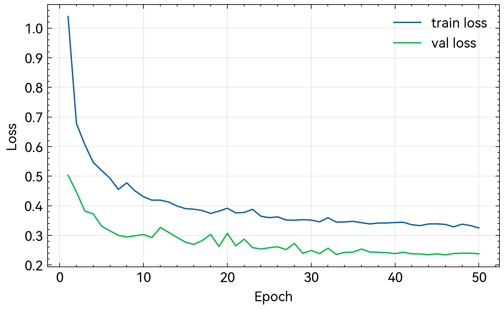
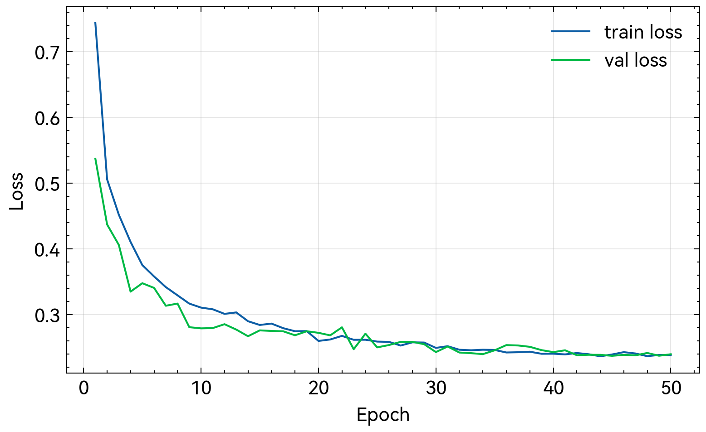
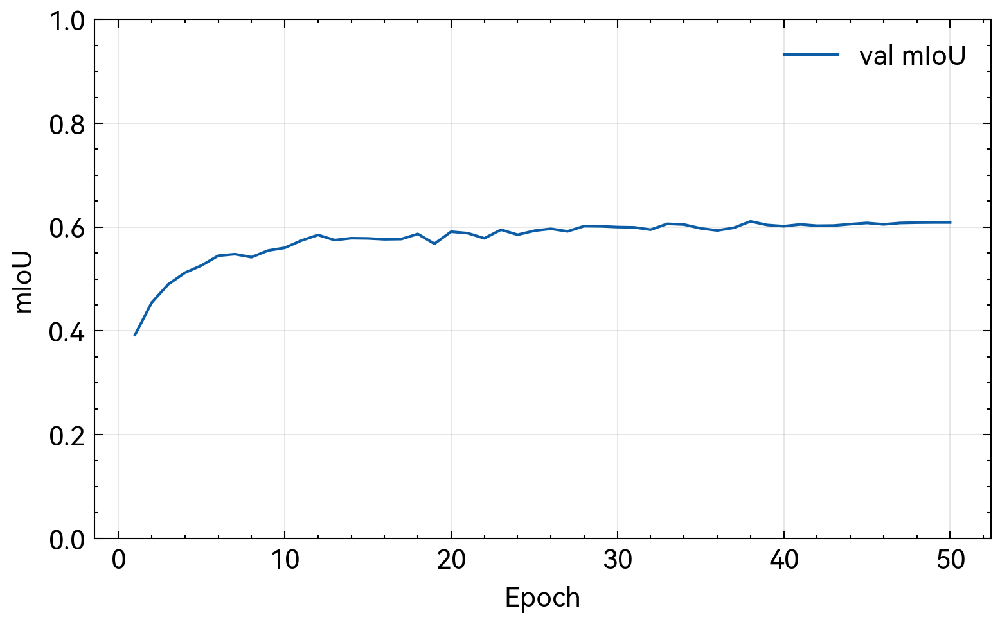
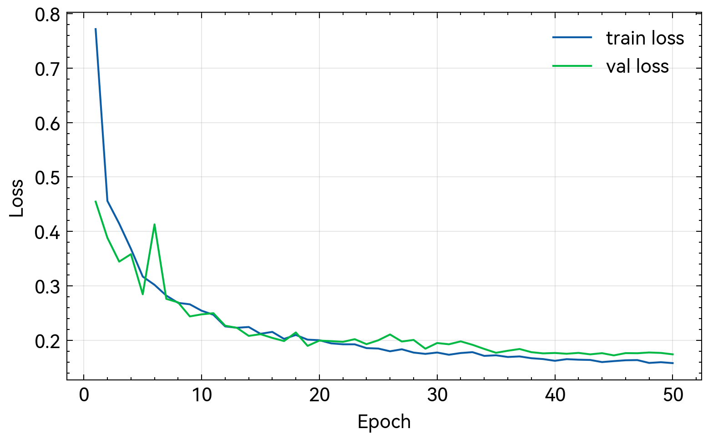

# 基于 PSPNet 的 CamVid 语义分割：实现与对照实验分析

## 摘要

语义分割要求对图像中每一个像素赋予语义类别标签，是场景理解与自动驾驶等应用中的关键技术。本文以 CamVid 城市街景数据集为实验对象，实现 PSPNet 并完成训练、评测与可视化流程。为了评估结构模块的实际贡献，本文在统一评测协议下设置强弱两类骨干网络，并引入 FCN 与 DeepLabv3+ 作为对照模型。实验显示，强骨干条件下 PPM 模块的边际增益极小，弱骨干条件下 decoder 对小目标与边界恢复具有显著优势。报告给出实验设置、实现流程、定量结果、训练曲线与可视化分析，并讨论失败模式与改进方向，从而形成可复现的程序报告与结论。

关键词：语义分割；PSPNet；CamVid；mIoU；对照实验；backbone

# 目录

第一章 背景介绍
第二章 算法原理介绍
第三章 程序设计与实现
第四章 程序测试与结果分析
第五章 结论
参考文献
附录

# 第一章 背景介绍

## 1.1 任务定义与应用

语义分割是计算机视觉中的像素级理解任务，其目标是对输入图像的每一个像素进行语义分类，例如道路、建筑、天空与行人等类别。相比图像分类输出单一标签，语义分割需要在保留空间结构的同时提供细粒度预测，因此对特征分辨率、边界细节与上下文信息提出更高要求。在自动驾驶系统中，语义分割可为目标检测与轨迹预测提供结构化先验；在机器人导航中，语义分割可用于可通行区域与障碍物的判别；在智能交通与城市分析中，语义分割可用于道路结构识别与场景要素统计。由于该任务兼具语义理解与空间对齐属性，其性能对下游应用的安全性与可靠性具有直接影响。

## 1.2 数据集：CamVid

CamVid[5] 是经典的城市场景语义分割数据集，提供视频帧及像素级标注。本文采用 11 类设置，并使用常见的 train、val 与 test 划分，其中训练集 367 张，验证集 101 张，测试集 233 张。CamVid 具有较强的场景一致性，但类别分布不均衡，细长结构与小目标类别数量稀少。图像分辨率较高，包含道路、建筑、行人、树木与交通设施等多样目标，适合评估模型在城市街景中的细节恢复能力。该数据集规模适中，能够在有限计算资源下完成多组对照实验，同时保持可解释的视觉场景，适用于程序设计与实验分析报告。

从数据分布上看，CamVid 的大类如 Road、Sky 与 Building 占据较高像素比例，模型在这些类别上更易取得较高 IoU，而诸如 Pole、SignSymbol 等细长结构具有明显的像素稀疏性，导致训练中梯度信号不足，预测结果容易出现断裂或漏检。该不平衡性使得单一指标难以全面反映模型表现，因此需要结合可视化与逐类分析进行解释。对于教学与工程实践而言，这一特点能够突出结构设计在细节恢复方面的差异，特别适用于比较 PPM 与 decoder 的结构贡献。

## 1.3 评测指标：mIoU

本文采用 mean Intersection over Union 作为主要评测指标。对于类别 c 的 IoU 定义为

$$IoU_c = \frac{TP_c}{TP_c + FP_c + FN_c}$$

其中 TP、FP、FN 分别为该类的真阳性、假阳性与假阴性像素数。mIoU 为各类 IoU 的平均值，忽略未出现类别。相较于像素准确率，mIoU 对类别不平衡更敏感，能够更真实地反映模型在小目标与难分类类别上的表现，因此在语义分割任务中被广泛采用。

## 1.4 研究目标与报告结构

本文旨在实现 PSPNet 语义分割系统，给出完整训练、评测与可视化流程，并在统一设置下与 FCN、DeepLabv3+ 进行对照实验，评估 PPM 与 decoder 的结构贡献。报告内容包括算法原理与结构说明、实现细节与训练配置、结果分析与可视化解释，以及失败案例与改进方向。通过系统化的程序报告，本文不仅提供可复现的实验流程，也对典型语义分割结构的作用机理进行解释，满足课程对程序演示与算法讲解的要求。

## 1.5 相关研究概述与本文定位

语义分割的发展经历了从传统图模型到深度学习的范式转移。早期方法主要依赖手工特征与条件随机场进行像素级标注，难以捕捉复杂场景中的语义结构。深度学习的兴起使端到端的像素分类成为可能，FCN 首次将分类网络转化为全卷积结构，显著提升了像素级预测能力。随后，基于多尺度上下文的结构逐渐成为主流，PSPNet 通过金字塔池化模块强调全局语义一致性，DeepLab 系列则通过空洞卷积与解码器设计增强边界恢复能力。本文的定位在于基于 CamVid 数据集完成 PSPNet 的工程实现，并通过严格对照实验明确不同结构模块在强弱骨干条件下的作用差异，从而在实践层面验证不同结构策略的有效性与适用边界。

## 1.6 任务难点与评价重点

语义分割的核心难点在于同时满足语义一致性与边界精度。城市街景中既存在大尺度区域，也包含小尺度目标与细长结构，这些目标在像素数量上占比很低，却对应用安全性具有重要意义。若模型只强调整体一致性，容易在边界处产生模糊；若模型过度依赖局部细节，可能造成噪声与误检。评价语义分割模型时，需要关注整体 mIoU，同时重视小目标与边界区域的表现。本文在报告中结合定量指标与可视化结果，旨在从不同角度解释模型性能差异，从而使结论更加完整与可靠。

# 第二章 算法原理介绍

## 2.1 PSPNet 总体结构

PSPNet[1] 的核心思想是在主干网络提取的高层语义特征之上引入 Pyramid Pooling Module，通过多尺度池化聚合上下文信息。该结构能够在保持局部细节的同时引入全局语义先验，有助于大场景类别与小目标类别的共同建模。整体流程可以理解为先由 backbone 提取多层特征，再由 PPM 对最高层特征进行多尺度聚合，随后通过上采样与融合层生成像素级分类结果。与仅依赖局部感受野的结构相比，PSPNet 更强调全局语义一致性，使模型能够在复杂场景中保持整体结构的合理性。

## 2.2 Pyramid Pooling Module

PPM 采用多分辨率区域池化策略，将输入特征图在不同尺度上进行池化，典型设置为 1×1、2×2、3×3 与 6×6 等网格尺度。各分支通过 1×1 卷积压缩通道后上采样回原特征尺寸，再与原特征拼接并通过卷积融合。该过程实现了从全局到局部的多尺度上下文聚合，从而增强模型对场景结构的理解。对于道路与天空等大区域类别，全局上下文有助于保持整体连贯性；对于行人、骑行者与交通标志等小目标类别，局部细节与上下文语义共同作用有助于减少误检与漏检。

在工程实现中，PPM 的多个分支通常共享相同的通道压缩比例，以避免在多尺度聚合时引入过大的参数量增长。多尺度池化后的特征上采样回原始特征尺寸，使得不同尺度上下文可以在通道维度融合，从而保持与后续卷积处理的一致性。该设计本质上是一种结构化上下文建模方法，避免了仅依赖更深网络堆叠来扩大感受野带来的优化负担。在 CamVid 这类场景中，PPM 主要提升对大范围结构的稳定识别能力，但对细粒度边界的直接改善有限，这一点也在本文的对照实验中得到体现。

## 2.3 对照模型与结构差异

为评估 PPM 与 decoder 的相对贡献，本文引入 FCN[2] 与 DeepLabv3+[3] 作为对照模型。FCN 代表经典全卷积分割基线，其核心思想是将分类网络改造为全卷积结构并输出像素级预测，缺少显式的多尺度上下文模块。DeepLabv3+ 在 ASPP 的基础上引入 decoder，通过低层特征与高层语义特征融合改善边界恢复与小目标细节。因此，PSPNet 与 FCN 的差异主要体现在 PPM 的引入，而 DeepLabv3+ 与 PSPNet 的差异主要体现在 decoder 的边界恢复能力。通过在统一训练设置下进行对照，可更直观地评估不同结构模块的实际贡献。

FCN 作为基线具有结构简单、推理成本相对较低的特点，但其对细节边界的恢复能力有限，常见问题是边界模糊与小目标遗漏。DeepLabv3+ 通过 ASPP 引入多尺度空洞卷积，提高感受野覆盖，同时利用 decoder 结合低层特征恢复细节，因此在边界精度方面通常优于 PSPNet 与 FCN。PSPNet 则更强调全局上下文一致性，对大区域类别具有较强稳定性。通过将三者置于同一实验框架中，本文能够在同一数据集与同一评测指标下比较它们的表现差异，从而避免跨论文结果带来的不可控变量。

## 2.4 语义分割中的结构性权衡

语义分割模型的设计常在全局语义一致性与局部边界精度之间权衡。仅依赖高层特征容易导致边界模糊，而过度依赖低层特征则可能引入噪声并削弱语义一致性。PPM 通过多尺度上下文增强高层语义，decoder 则通过低层细节恢复提高边界质量。本文对照实验的目的在于判断在 CamVid 这样的中等规模城市街景数据集上，哪类结构贡献更显著，从而为模型选择提供实践依据。

## 2.5 多尺度上下文与细节恢复的互补关系

从视觉任务的角度看，城市街景包含大尺度结构与小尺度目标共存的特点。道路、天空与建筑等大区域类别需要全局上下文才能保持一致性，而行人、杆状物与交通标志等小目标类别则依赖精细边界与局部纹理。PPM 的优势在于通过多尺度池化注入全局语义，减少局部误判，但其对细节边界的直接改善有限。decoder 的优势在于利用低层特征恢复边界细节，改善小目标的轮廓与位置精度，但其对全局一致性的贡献较弱。两者从不同方向改善分割质量，因此在模型设计中具有互补关系。本文通过对照实验分析 PPM 与 decoder 在不同骨干强度下的相对贡献，从而验证这一互补性在实际数据集中的表现。

## 2.6 Backbone 选择与预训练影响

语义分割模型的性能高度依赖骨干网络的特征表达能力。强骨干如 ResNet-50[4] 在高层语义特征上具有更强表达能力，能够为分割头提供更稳定的语义信息，因此即便分割结构相对简单，也能获得较好的结果。弱骨干如 ResNet-18 则在高层特征表达上存在限制，导致分割头需要更多结构性补偿，例如通过 decoder 引入低层细节来弥补语义不足。预训练权重进一步提升了骨干的泛化能力，使模型在小数据集上更易收敛，并减少训练初期的不稳定性。本文通过强弱骨干对照实验，展示了骨干强度与结构模块之间的交互作用，为实际工程选择提供依据。

# 第三章 程序设计与实现

## 3.1 系统实现与代码结构

本实验实现采用模块化组织，数据集处理、模型定义、训练与评测分别封装在独立文件中。数据集加载与增强过程位于 `src/data/camvid.py`，模型结构实现位于 `src/models/pspnet.py`、`src/models/deeplabv3plus.py` 与 `src/models/fcn.py`，训练脚本位于 `code/segmentation/train_camvid.py`，评测与可视化脚本位于 `code/segmentation/eval_camvid.py`，训练曲线绘制位于 `code/segmentation/plot_training_curves.py`。该结构便于复现实验流程并支持多模型对照实验。

## 3.2 数据预处理与增强

训练阶段采用随机缩放、随机裁剪与随机水平翻转。随机缩放引入尺度变化，随机裁剪控制输入尺寸并提供位移不变性，随机翻转增强左右对称性。验证与测试阶段仅进行固定尺寸 resize，避免引入额外随机性。标签中 Void 类统一映射为 ignore_index=255，在损失计算与 mIoU 评估中忽略，从而避免无效类别影响统计结果。该设置与多数语义分割实践一致，同时适配 CamVid 数据标注特点。

## 3.3 训练配置与优化策略

训练采用带动量的 SGD 优化器，动量为 0.9，权重衰减为 1e-4，损失函数为 CrossEntropyLoss 并设置 ignore_index。输入裁剪尺寸为 360×480，训练轮数为 50 个 epoch。学习率调度采用 Poly 策略，按迭代次数衰减，形式为

$$lr = base\_lr \times (1 - \frac{iter}{max\_iter})^{0.9}$$

该策略在语义分割任务中具有稳定性，能够在训练后期逐步降低学习率以细化参数更新。默认使用 ImageNet 预训练权重作为骨干初始化，以提高收敛速度并提升小数据集上的泛化能力。训练过程采用统一的 batch size 为 4，以保证不同模型在显存限制下具有可比性。

在训练过程中，损失下降速度与验证 mIoU 的提升并非完全同步。语义分割任务中，模型可能在损失持续下降的同时出现验证指标平台期，这与类别不平衡以及边界像素比例较低有关。为减少过拟合与指标波动，训练中保留 best checkpoint 并以其作为对照评价依据，同时记录最终模型权重用于分析收敛末期的稳定性。该策略使结果更具可解释性，也便于在模型对照时保持评价标准一致。

## 3.4 复现实验设置与对照设计

本文设置强弱两类 backbone 作为对照条件。强 backbone 使用 ResNet-50，弱 backbone 使用 ResNet-18。每类 backbone 下训练 PSPNet、FCN 与 DeepLabv3+ 三种模型，形成六组可比实验。该设计使得模型结构差异与骨干强度差异能够被区分分析，从而识别结构模块在不同特征表达能力条件下的作用差异。复现实验命令在代码中统一记录，训练产物包括最佳模型权重、最终模型权重与训练日志，评测产物包括 mIoU 指标与可视化样例。

## 3.5 评测与可视化流程

评测流程对验证集进行前向推理，计算混淆矩阵并输出 mIoU 指标，同时导出可视化结果，包括输入图、标注图与预测图。可视化结果用于分析边界恢复、细长结构识别与小目标类别的表现差异。训练曲线绘制脚本以训练日志为输入，生成 loss 与 mIoU 曲线，展示不同模型的收敛速度与稳定性。该流程确保实验结果不仅具有定量指标，还具备直观的可解释性。

## 3.6 训练稳定性与复现性控制

语义分割训练受随机初始化、数据加载顺序与 GPU 并行计算等因素影响，单次训练结果可能存在轻微波动。为降低这种不确定性，本实验统一了所有模型的训练轮次、学习率调度与数据增强策略，并采用相同 batch size 与权重衰减配置，使模型间差异尽可能仅来自结构本身。训练脚本在日志中记录关键超参数与运行标识，评测脚本保存指标文件与可视化目录，确保结果可追溯。通过固定配置与统一流程，本文在复现层面达到了可解释且可重复的实验条件。

## 3.7 资源消耗与效率考量

语义分割模型通常具有较高的计算开销，尤其在高分辨率输入与多尺度结构下更为明显。为适配实际计算资源，本文采用 360×480 的裁剪输入，并将 batch size 固定为 4，以保证训练过程可在单卡显存条件下完成。对于结构对比而言，PSPNet 与 DeepLabv3+ 均具有额外模块带来的计算代价，而 FCN 结构相对简单。尽管本文主要关注精度对比，但在实际工程场景中，速度与内存占用同样是模型选择的重要因素。后续可在统一硬件环境下记录推理速度与显存消耗，以便形成更全面的模型评价体系。

在工程复现中，资源配置会直接影响可行的模型规模与训练轮次。较小的 batch size 可能带来梯度估计噪声增大，但在显存受限时是必要选择。为了保持对照公平性，本文对所有模型采用相同的输入尺寸与 batch size，从而将资源差异对结果的影响降到最低。若在更高分辨率或更大 batch size 下训练，模型性能可能进一步提升，但同时需要更高的计算资源支持，这一点应在后续扩展实验中加以权衡。

# 第四章 程序测试与结果分析

## 4.1 定量结果与对照分析

本文汇总两组 backbone 条件下三种模型在 CamVid 验证集的结果。表 4-1 给出强 backbone 条件下的 mIoU，表 4-2 给出弱 backbone 条件下的 mIoU。所有结果均以 best checkpoint 为准，确保对比基于各模型的最优表现。

在训练过程中，各模型的最佳 epoch 并不完全一致，这反映了不同结构对学习率调度与训练动态的响应差异。部分模型在中期达到峰值后进入平台期，说明在有限训练轮数下已接近其可达性能上限。选择 best checkpoint 作为评价依据有助于避免过拟合或后期震荡对结果的干扰，使对照分析更具公平性。

**表 4-1** ResNet-50 条件下的 mIoU 结果

| 模型 | Backbone | mIoU (val) | Best epoch | run id |
|:---|:---|---:|---:|:---|
| PSPNet | ResNet-50 | 0.7534 | 48 | seg-v2-pspnet |
| FCN | ResNet-50 | 0.7535 | 50 | seg-v2-fcn |
| DeepLabv3+ | ResNet-50 | 0.7603 | 48 | seg-v2-deeplabv3plus |

在 ResNet-50 条件下，PSPNet 与 FCN 的 mIoU 几乎一致，表明 PPM 在强骨干与预训练条件下的增益非常有限。DeepLabv3+ 略优于 PSPNet 与 FCN，提升幅度较小，说明在强特征表达能力下结构差异被一定程度削弱。

**表 4-2** ResNet-18 条件下的 mIoU 结果

| 模型 | Backbone | mIoU (val) | Best epoch | run id |
|:---|:---|---:|---:|:---|
| PSPNet | ResNet-18 | 0.6191 | 40 | seg-r18-pspnet |
| FCN | ResNet-18 | 0.6108 | 38 | seg-r18-fcn |
| DeepLabv3+ | ResNet-18 | 0.7097 | 45 | seg-r18-deeplabv3plus |

在 ResNet-18 条件下，整体性能明显下降，但结构差异显著放大。DeepLabv3+ 相比 PSPNet 与 FCN 具有接近 9 个百分点的优势，说明 decoder 的低层特征融合在弱骨干条件下具有明显贡献。

## 4.2 Backbone 强度影响

将 ResNet-50 与 ResNet-18 的结果进行对比可以观察到骨干强度对模型性能的显著影响。PSPNet 的 mIoU 从 0.7534 降至 0.6191，FCN 从 0.7535 降至 0.6108，DeepLabv3+ 从 0.7603 降至 0.7097。DeepLabv3+ 的下降幅度明显小于 PSPNet 与 FCN，说明 decoder 的存在缓解了弱骨干带来的特征表达不足问题。该结果表明，在资源受限或轻量化场景中，decoder 模块对保持性能具有重要意义。

## 4.3 结构贡献分析

本文通过同一 backbone 下的模型差异评估结构模块的作用。PSPNet 与 FCN 的差异主要来自 PPM，DeepLabv3+ 与 PSPNet 的差异主要来自 decoder。强骨干条件下，PSPNet 与 FCN 的差距几乎为零，说明 PPM 的边际收益被强骨干掩盖；弱骨干条件下，PPM 带来约 0.0083 的小幅提升，仍处于相对有限的范围。相对而言，decoder 在弱骨干条件下带来 0.0906 的显著提升，说明低层特征融合在弱特征表达条件下更为关键。由此可见，PPM 更偏向增强全局语义一致性，而 decoder 更直接改善边界与小目标细节，二者在不同场景下贡献差异显著。

## 4.4 训练曲线与收敛行为

训练曲线用于观察不同模型的收敛速度与稳定性。ResNet-50 条件下，PSPNet 的损失下降平稳，验证 mIoU 在中后期趋于收敛，说明强骨干与预训练使优化过程更稳定。

**图 4-1** ResNet-50 条件下 PSPNet 训练损失曲线

PSPNet 的 mIoU 曲线在后期趋于平台，显示在强骨干条件下结构增益有限。

**图 4-2** ResNet-50 条件下 PSPNet 验证集 mIoU 曲线

FCN 在强骨干下的收敛形态与 PSPNet 接近，但整体提升幅度略小，说明缺少 PPM 时全局语义增益有限。

**图 4-3** ResNet-50 条件下 FCN 训练损失曲线

**图 4-4** ResNet-50 条件下 FCN 验证集 mIoU 曲线

DeepLabv3+ 在强骨干下的曲线与 PSPNet 接近，但在后期仍保持轻微优势，反映 decoder 的边界恢复对收敛末期仍有帮助。

**图 4-5** ResNet-50 条件下 DeepLabv3+ 训练损失曲线

**图 4-6** ResNet-50 条件下 DeepLabv3+ 验证集 mIoU 曲线

弱骨干条件下，PSPNet 的 mIoU 曲线在中期出现平台，说明骨干表达能力不足时结构增益难以持续发挥。

**图 4-7** ResNet-18 条件下 PSPNet 训练损失曲线

**图 4-8** ResNet-18 条件下 PSPNet 验证集 mIoU 曲线

FCN 在弱骨干下更早进入平台期，表现出缺少细节恢复结构时的性能上限。

**图 4-9** ResNet-18 条件下 FCN 训练损失曲线

**图 4-10** ResNet-18 条件下 FCN 验证集 mIoU 曲线

DeepLabv3+ 在弱骨干下仍持续提升，说明 decoder 的低层特征融合对弱骨干场景更为关键。

**图 4-11** ResNet-18 条件下 DeepLabv3+ 训练损失曲线

**图 4-12** ResNet-18 条件下 DeepLabv3+ 验证集 mIoU 曲线

## 4.5 可视化对比分析

可视化结果对模型差异提供直观支持。PSPNet 与 FCN 在大区域类别如道路、天空与建筑上表现稳定，但在行人、杆状物体与交通标志等小目标类别上容易出现漏检或边界模糊。DeepLabv3+ 的预测结果在边界连续性与小目标识别上明显更好，尤其在道路与人行道的交界处，以及细长物体的轮廓处表现出更连续的边界线。该现象与 decoder 的低层特征融合机制一致，说明细节恢复能力对 CamVid 这类数据集具有较强影响。

为了保证可视化对比具有代表性，本文选择包含道路边界与小目标类别的样例进行展示，避免仅展示容易分割的场景导致结论偏乐观。

为展示可视化差异，选取验证集样例 000，并给出输入图、标注图及三种模型在 ResNet-50 条件下的预测结果。该样例展示了道路与建筑交界处的边界差异与小目标预测的细节变化。

| 输入 | 标注 | PSPNet | FCN | DeepLabv3+ |
|---|---|---|---|---|
|  |  |  |  |  |

## 4.6 失败案例与误差模式

从 per-class IoU 可以观察到难点类别集中在小目标与细长结构，例如 Pole、SignSymbol 与 Pedestrian。该现象与 CamVid 类别分布不均衡有关，也与图像分辨率对小目标细节的压缩有关。PSPNet 与 FCN 在弱骨干条件下对 Pedestrian 的识别能力明显不足，DeepLabv3+ 通过 decoder 显著改善这一问题。另一个常见误差是边界模糊，尤其在 Road、Sidewalk 与 Fence 的交界处，PSPNet 的预测倾向于形成大区域一致性而忽略边界细节。光照变化与遮挡也会导致 Tree 与 Building、Sign 等类别混淆，错误多集中在阴影或遮挡区域。上述误差模式说明，在城市街景中边界细节与小目标识别是影响性能的重要因素。

在复杂场景中，标注本身存在一定噪声与不确定性，例如细线结构或边界模糊区域的标签可能在标注者之间存在差异，这会使模型在这些区域难以取得一致预测。模型在此类区域的误差不完全代表结构缺陷，也反映了数据集标注的内在不确定性。尽管如此，从整体趋势看，具有 decoder 的结构在边界与小目标上的优势仍然明显，说明结构设计能够在一定程度上抵消标注噪声带来的不利影响。

## 4.7 结果可信度与局限性

本文实验严格控制训练设置并保证对照公平性，但仍存在可改进之处。实验主要基于单次训练结果，未进行多随机种子重复实验，因此统计意义上的稳健性仍有限。深度模型训练的随机性可能导致少量性能波动，尤其在小数据集上表现更明显。此外，CamVid 数据集规模有限，结论在更大规模数据集上的外推需要进一步验证。尽管如此，本文的对照实验在结构差异上呈现一致趋势，具有较高的解释价值，足以支撑对 PPM 与 decoder 贡献差异的结论。

## 4.8 结果解释与工程启示

综合定量与可视化结果可以得出较为明确的工程启示。在强骨干条件下，复杂结构模块带来的收益有限，模型性能主要受骨干表达能力与预训练质量影响。在弱骨干条件下，结构模块对性能的贡献明显放大，其中 decoder 的效果更为显著。这意味着在实际应用中，若硬件允许使用强骨干，模型结构可选择相对简化以降低复杂度；若硬件或速度限制需要使用轻量骨干，则应优先考虑具有较强细节恢复能力的结构设计。该启示对于城市街景分割等应用具有较高的参考价值。

## 4.9 逐类趋势与类别难度分析

虽然本文主要报告整体 mIoU，但从可视化与训练日志可以推断类别难度存在明显差异。大区域类别如 Road、Sky 与 Building 通常具有高 IoU，且在不同模型之间差距不大，说明这些类别主要由全局结构与颜色纹理决定。小目标与细长结构类别如 Pedestrian、Pole 与 SignSymbol 更依赖边界精度与细粒度纹理，结构差异在这些类别上更容易体现。PSPNet 的 PPM 有助于提升大区域类别的一致性，但对细长结构的直接改善有限；DeepLabv3+ 通过 decoder 引入低层特征，更有效地恢复细节边界，因此在难类别上表现更好。该趋势表明，评估语义分割模型时不应仅依赖总体指标，还应关注难类别表现与场景细节恢复质量。

## 4.10 可视化案例的结构性解读

在道路与人行道交界区域，PSPNet 的预测结果更倾向于形成平滑的大区域块状结构，边界处存在一定模糊，而 DeepLabv3+ 的预测边界更连贯且更接近标注形状。这一差异符合 decoder 通过低层特征融合增强边界细节的设计初衷。在树木与建筑交界处，PSPNet 由于强调全局一致性，容易将相近纹理区域归为同一类别，从而产生误判，而 DeepLabv3+ 在局部细节上具有一定优势，误判区域较少。对于行人与骑行者等小目标，PSPNet 的预测经常出现断裂或漏检，DeepLabv3+ 的预测更完整，但仍存在遮挡与尺度变化导致的错误。这些现象从可视化层面支持了结构贡献分析的结论，使定量结果具有更直观的解释基础。

## 4.11 结构选择的实践建议

从 CamVid 的实验结果看，结构选择应结合骨干强度与目标需求。在强骨干条件下，模型已经具备较强的语义表达能力，此时增加复杂模块的收益有限，反而可能增加训练成本与推理延迟。在弱骨干条件下，结构模块对性能的影响更明显，尤其是 decoder 对边界与小目标的修复作用显著，适合作为轻量化模型的优先补强方向。若应用场景对边界质量要求较高，如道路边界或行人轮廓识别，应优先采用具有细节融合能力的结构。
另一方面，PPM 强调全局一致性，对于大区域类别的稳定性具有一定价值。在场景中大区域占比高且噪声较多时，PPM 可提升整体预测的连贯性与一致性。实践中可根据数据集特点与目标需求在 PPM 与 decoder 之间进行权衡，或考虑二者结合的结构设计，以实现全局语义与局部细节的兼顾。

# 第五章 结论

本文基于 CamVid 数据集实现 PSPNet 语义分割系统，并在统一设置下与 FCN、DeepLabv3+ 进行对照实验。实验结果表明，强骨干条件下 PPM 的边际增益极小，弱骨干条件下 decoder 对小目标与边界恢复具有显著优势。该结论说明，在资源受限或轻量化场景中，增强低层特征融合的结构更为关键，而在强骨干条件下结构差异被弱化。本文的实验流程、训练配置与可视化分析构成完整可复现实验报告，为语义分割模型的结构选择提供了可参考的实践依据。

从方法论角度看，本报告体现了程序实现与实验分析的闭环流程。通过在统一设置下比较多个模型结构，本文避免了将性能差异简单归因于训练技巧或数据处理的误判。对照实验与可视化分析相结合，使结论不仅具有数值依据，也具有可解释的视觉证据。该流程有助于培养对模型结构与任务特性之间关系的理解能力，同时符合课程对程序报告的规范要求。

未来工作可在更大规模数据集上验证上述结论，并引入多随机种子重复实验与统计显著性分析以提高结论稳健性。同时，可探索更高分辨率特征、更强 decoder 或边界相关损失函数，以提升细长结构与小目标类别的识别效果，从而进一步改进在城市街景场景中的语义分割性能。

除精度提升之外，还可关注模型在不同硬件平台上的推理效率与部署可行性，例如在嵌入式或移动端设备上进行速度与功耗评估，以便在真实场景中平衡精度与实时性需求。针对小目标类别的进一步提升，也可结合类别重加权或难样本挖掘策略，以改善类别不均衡带来的性能瓶颈。

在工程落地中，数据标注质量与场景覆盖度同样影响模型性能，未来可结合更丰富的城市场景数据进行交叉验证，以提升模型在复杂环境中的鲁棒性。

# 参考文献

1. Zhao H, Shi J, Qi X, Wang X, Jia J. Pyramid Scene Parsing Network. In: CVPR. 2017.
2. Long J, Shelhamer E, Darrell T. Fully Convolutional Networks for Semantic Segmentation. In: CVPR. 2015.
3. Chen L C, Zhu Y, Papandreou G, Schroff F, Adam H. Encoder-Decoder with Atrous Separable Convolution for Semantic Image Segmentation (DeepLabv3+). In: ECCV. 2018.
4. He K, Zhang X, Ren S, Sun J. Deep Residual Learning for Image Recognition. In: CVPR. 2016.
5. Brostow G J, Shotton J, Fauqueur J, Cipolla R. Segmentation and Recognition Using Structure from Motion Point Clouds. In: ECCV. 2008.

# 附录

附录可包含开发日志、成员分工、关键配置与运行截图等材料。
