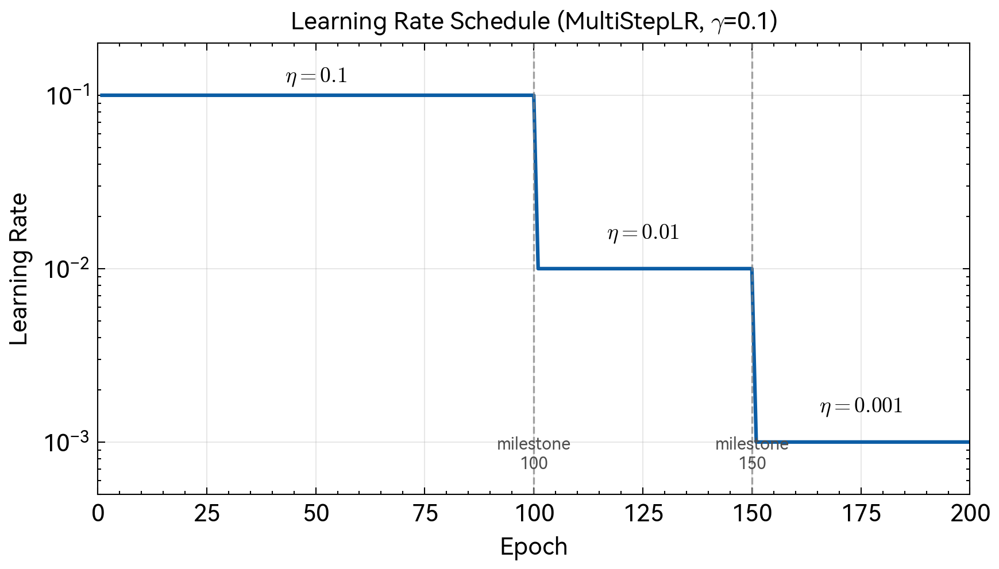
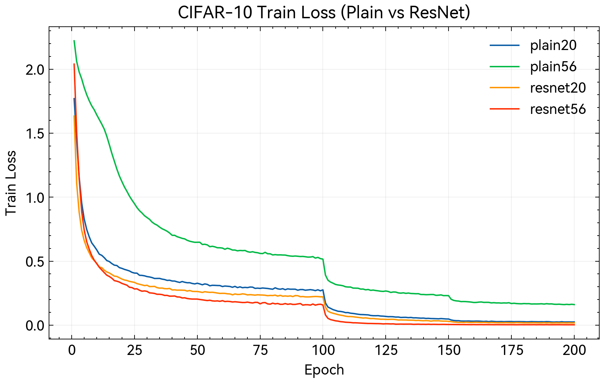
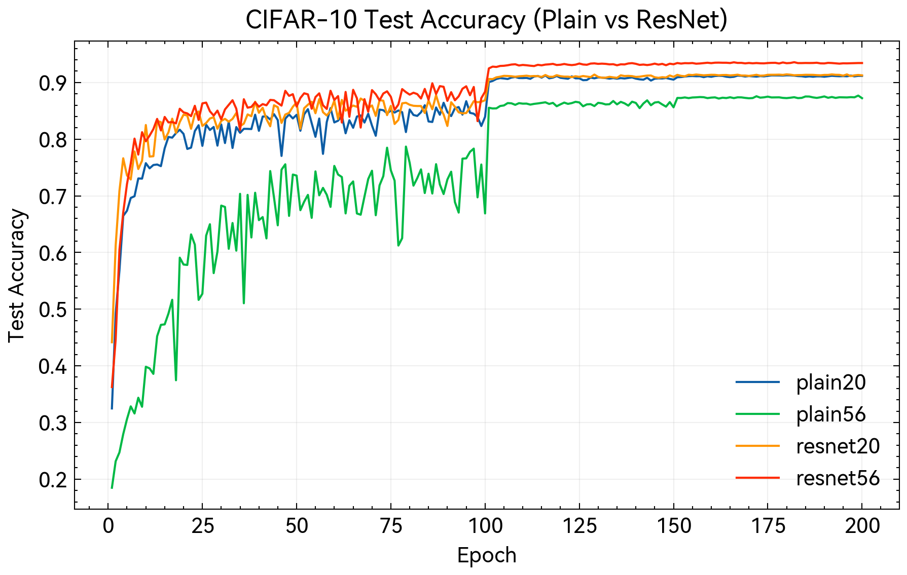

# 深度残差网络图像分类研究

## 基于 CIFAR-10 数据集的 ResNet 论文复现

摘要：深度卷积神经网络在图像分类任务中取得了显著成功，但随着网络深度增加，训练难度迅速上升，甚至出现性能退化现象。He 等人于 2016 年提出深度残差网络，通过引入恒等映射的捷径连接缓解深层网络优化困难。本文在 CIFAR-10 数据集上复现原论文核心实验，构建 Plain-20、Plain-56、ResNet-20 与 ResNet-56 四组对照网络，验证退化现象与残差学习的有效性。实验结果显示，56 层 Plain 网络测试准确率为 87.69%，显著低于 20 层 Plain 网络的 91.27%，表明深层 Plain 网络存在退化。ResNet-56 的测试准确率达到 93.58%，不仅优于同深度 Plain 网络，也高于 ResNet-20 的 91.44%，证明残差连接能够显著改善深层网络的可训练性与性能。本文在报告中系统梳理卷积神经网络的发展脉络，给出残差学习的理论基础与工程实现细节，形成可重复的实验流程，并围绕复现实验结果讨论原论文结论的可验证性、实验限制与进一步改进方向。

关键词：深度学习；残差网络；图像分类；CIFAR-10；degradation

# 目录

第一章 绪论
第二章 深度残差网络原理
第三章 实验设计与实现
第四章 实验结果与分析
第五章 结论
参考文献

# 第一章 绪论

## 1.1 研究背景与意义

图像分类是计算机视觉中的基础任务，其目标是将输入图像准确归类到预定义语义类别。深度卷积神经网络通过多层非线性变换学习从低级纹理到高级语义的层次化表示，已成为该任务的核心方法。从函数逼近角度看，增加网络深度可显著提升表达能力，但实践中发现网络深度超过一定阈值后性能不升反降，这一现象被称为退化问题。退化并非过拟合所致，因为深层网络在训练集上的误差同样高于浅层网络。该现象揭示深层网络优化存在本质困难，限制了深度带来的潜在优势。

He 等人于 2016 年提出深度残差网络[1]，通过捷径连接构建残差学习框架，使网络层学习输入与输出之间的残差映射而非直接映射，从而显著降低优化难度。ResNet 在 ILSVRC 2015 中以 152 层深度取得 top-5 错误率 3.57% 的结果，首次超越人类水平。该工作不仅解决深层网络训练的核心问题，也确立了通过结构设计改善优化的研究范式，对后续深度学习架构发展产生深远影响。残差思想随后被广泛用于目标检测、语义分割、关键点估计以及视觉表示学习等任务中，成为现代深度视觉模型的基础组件之一。

本文旨在 CIFAR-10 数据集上复现 ResNet 原论文的关键对照实验，通过严格控制变量验证两点结论：深层 Plain 网络存在退化现象，残差连接能够有效缓解该问题。复现工作强调可重复性与可解释性，并通过实际实现深化对残差学习机制的理解。与简单的复跑不同，本文将原论文的设计思想和实验逻辑转换为规范化、可执行的工程流程，辅以细化的训练设置与数据预处理说明，确保其他研究者能够在相同约束下复现实验。

## 1.2 卷积神经网络发展综述

### 1.2.1 早期卷积网络的兴起

卷积神经网络的基本架构可追溯至 LeCun 等人于 1998 年提出的 LeNet-5[2]，该工作系统性整合了局部感受野、权值共享与空间下采样等核心思想。Krizhevsky 等人于 2012 年提出 AlexNet[3]，在 ImageNet 分类任务中将 top-5 错误率从 26.2% 降至 15.3%，通过 ReLU 激活函数、Dropout 正则化与数据增强等技术显著提升了深层网络的训练效果。AlexNet 的成功标志着深度学习在计算机视觉领域的全面复兴，促使研究者开始探索更深层网络结构的可能性。

### 1.2.2 VGGNet：深度的价值

Simonyan 和 Zisserman 于 2014 年提出 VGGNet[4]，系统研究网络深度对性能的影响。VGGNet 采用统一的 3×3 小卷积核堆叠，通过增加网络深度提升模型容量。两个 3×3 卷积层的感受野等价于 5×5，三个 3×3 卷积层等价于 7×7，在相同感受野下参数量更少，同时引入更多非线性层增强表达能力。VGG-16 和 VGG-19 在 ILSVRC 2014 中表现优异，验证了深度是提升性能的有效途径，但其参数量巨大，计算代价较高。VGG 的贡献在于以简洁结构系统验证深度对性能的影响，为后续更深网络的设计提供了可操作的结构范式。

### 1.2.3 GoogLeNet 与 Inception：宽度与多尺度

Szegedy 等人于 2014 年提出 GoogLeNet[5]，探索网络宽度与多尺度特征融合。其核心 Inception 模块在同一层级并行使用 1×1、3×3、5×5 卷积与池化操作，并在通道维度拼接输出，同时通过 1×1 卷积进行降维以控制计算量。GoogLeNet 以约 500 万参数在 ILSVRC 2014 中夺冠，展示了结构设计在性能与效率之间取得平衡的可能性。Inception 系列工作强调了网络结构的多分支与多尺度特性，为复杂视觉场景中的特征表达提供了有效路径。

### 1.2.4 批量归一化：训练的稳定化技术

Ioffe 与 Szegedy 于 2015 年提出批量归一化[6]，通过对 mini-batch 激活值进行标准化处理稳定分布，并引入可学习缩放与平移参数。其核心形式为

$$\hat{x}_i = \frac{x_i - \mu_B}{\sqrt{\sigma_B^2 + \epsilon}}$$
$$y_i = \gamma \hat{x}_i + \beta$$

该方法允许使用更大学习率，加快收敛，降低初始化敏感性，并具有一定正则化效果。尽管批量归一化显著改善了训练稳定性，但在更深网络中退化问题仍然存在，这表明优化困难并不能仅依赖训练技巧解决，需要更具结构性的方案。

### 1.2.5 Highway Networks：捷径连接的探索

在 ResNet 提出之前，Srivastava 等人于 2015 年 5 月发表了 Highway Networks[7]，首次实现了超过百层的前馈网络稳定训练。该架构从 LSTM 循环网络的门控机制中获得启发，在前馈网络中引入可学习的门控单元以调节不同路径间的信息分配。Highway Networks 的基本思想在于构建信息传递的"高速通路"，使部分信号可以绕过中间层的非线性变换直接抵达更深层级。

Highway block 的前向传播可写为

$$\mathbf{y} = \mathcal{H}(\mathbf{x}, W_H) \cdot T(\mathbf{x}, W_T) + \mathbf{x} \cdot C(\mathbf{x}, W_C)$$

上式中 $\mathcal{H}$ 表示常规的非线性变换分支，$T$ 与 $C$ 分别为 transform gate 和 carry gate，用于控制信息在变换路径与直通路径间的分配比例。实践中通常令 $C = 1 - T$，从而仅需学习单个门控函数。门控函数 $T$ 基于 sigmoid 激活，其输出值介于 0 与 1 之间，动态调节当前层是执行非线性变换还是保持恒等传递。这种自适应的门控策略使网络在训练过程中能够根据优化需求选择合适的信息流动模式。

Srivastava 等人的实验显示，门控捷径连接能够支持深度超过 100 层的网络训练，且未观察到随深度增加的性能退化。这一结果揭示了通过架构设计改善梯度传播的可行性，也直接启发了 ResNet 的设计思路。He 等人在 Highway Networks 基础上做了关键简化，将参数化的门控机制替换为无参数的恒等映射，既保持了训练稳定性，又显著降低了模型复杂度与计算开销。

### 1.2.6 退化问题的本质

退化问题指网络深度增加后准确率先饱和后下降的现象。理论上深层网络的解空间包含浅层网络解空间，若新增层学习恒等映射，深层网络不应劣于浅层网络。实践中标准优化算法难以找到这样的解，主要原因在于误差曲面更加复杂、鞍点更多，梯度在多层链式传播中易衰减或爆炸。退化问题反映的是优化困难而非模型容量不足，ResNet 正是针对这一问题提出结构性解决方案。该问题的研究意义在于，它揭示了深度模型的性能上限不仅由表达能力决定，还受到优化机制的约束。

## 1.3 研究内容与结构安排

本文工作聚焦于 ResNet 在 CIFAR-10 上的核心对照实验复现。研究内容包括 Plain 网络与 ResNet 的实现，20 层与 56 层两种深度设置的构建，在统一数据增强与训练配置下进行对照训练，通过训练损失与测试准确率曲线验证退化现象与残差连接的改善效果，并形成可复现实验流程与结果分析。全文结构上，第二章介绍残差学习原理与 CIFAR-10 版 ResNet 架构，第三章给出实验环境、数据处理、训练配置与实现细节，第四章展示实验结果并结合曲线分析与原论文对照进行讨论，第五章总结结论并提出局限与改进方向。

## 1.4 相关研究与本研究定位

近年来卷积神经网络的结构演化呈现出从单纯加深到结构化设计的趋势。早期工作强调深度的价值，后续研究则在结构与训练稳定性之间寻找平衡。ResNet 的提出属于这一脉络中的关键节点，其价值不在于引入新的操作，而在于通过结构性连接改变优化行为，从而允许极深网络稳定训练。与仅通过正则化或训练技巧提升性能的路线相比，残差学习更接近对优化机制的结构性改造，也因此被广泛复用为后续模型的基础结构。本文的复现工作定位于经典结论的可验证性与教学价值，通过在小规模数据集上严格对照复现，呈现退化现象与残差连接的影响机制，并将原论文中的关键设定转化为可执行的工程流程，以便更清晰地理解残差学习的实际效应。

# 第二章 深度残差网络原理

## 2.1 残差学习框架

### 2.1.1 问题的重新表述

设 $\mathcal{H}(\mathbf{x})$ 表示堆叠层需要拟合的目标映射，其中 $\mathbf{x}$ 为输入。传统方式要求网络直接逼近 $\mathcal{H}(\mathbf{x})$，在深层网络中这一目标难以优化。残差学习将目标改写为残差函数

$$\mathcal{F}(\mathbf{x}) := \mathcal{H}(\mathbf{x}) - \mathbf{x}$$
$$\mathcal{H}(\mathbf{x}) = \mathcal{F}(\mathbf{x}) + \mathbf{x}$$

当最优映射接近恒等映射时，学习残差为零更易于优化。此时残差分支只需输出接近零的小扰动，相比直接学习恒等映射更容易收敛。该思想强调了学习目标的重参数化对优化过程的影响，也为深层网络的稳定训练提供了理论基础。

### 2.1.2 残差块结构

残差块是 ResNet 的基本单元。在 CIFAR-10 设定下，本文采用 Basic Block，由两个 3×3 卷积层与配套 BN、ReLU 组成，并通过恒等捷径连接实现残差相加。其前向传播形式为

$$\mathbf{y} = \mathcal{F}(\mathbf{x}, \{W_i\}) + \mathbf{x}$$

当输入输出维度不匹配时，引入投影分支 $W_s$ 进行匹配。

$$\mathbf{y} = \mathcal{F}(\mathbf{x}, \{W_i\}) + W_s \mathbf{x}$$

原论文提出 Option A 与 Option B 两种维度匹配策略，本文采用 Option A，即在下采样时通过跨步采样降低空间尺寸，并以零填充方式扩展通道数，避免引入额外参数，以保持与原论文 CIFAR 设定一致。该选择的动机在于保持模型容量的严格可比性，从而使对照实验更具解释力。

### 2.1.3 残差学习的优化优势

残差结构通过恒等映射为优化提供易达的基准解，减轻直接学习恒等映射的难度。捷径连接在反向传播中提供无衰减的梯度通路，梯度可以直接回传至浅层，从而缓解梯度消失。大量经验表明，残差网络的损失曲面更平滑，优化更易收敛，这也是深层 ResNet 在实践中稳定训练的关键原因。残差学习并不改变模型的表达上限，而是显著改变优化路径，使得深层网络更接近可训练区域。

从反向传播的角度分析，残差连接的梯度传播机制可以更清晰地解释其优化优势。设损失函数为 $\mathcal{L}$，残差块的前向传播为 $\mathbf{y} = \mathcal{F}(\mathbf{x}) + \mathbf{x}$，根据链式法则，输入 $\mathbf{x}$ 处的梯度可表示为

$$\frac{\partial \mathcal{L}}{\partial \mathbf{x}} = \frac{\partial \mathcal{L}}{\partial \mathbf{y}} \cdot \left(I + \frac{\partial \mathcal{F}}{\partial \mathbf{x}}\right)$$

上式右侧包含恒等项 $I$ 与残差分支的 Jacobian 矩阵之和。恒等项的存在确保了梯度存在一条无衰减的传播通路。当残差分支 $\mathcal{F}$ 的梯度 $\partial \mathcal{F} / \partial \mathbf{x}$ 趋于零时（这可能由激活函数饱和或权重初始化过小导致），恒等项使得 $\partial \mathcal{L} / \partial \mathbf{x}$ 至少保持为 $\partial \mathcal{L} / \partial \mathbf{y}$ 的量级，从而避免了传统深层网络中常见的梯度消失现象。

将上述分析推广至包含 $L$ 个残差块的深层网络，从初始输入 $\mathbf{x}_0$ 到输出 $\mathbf{x}_L$ 的梯度传播可写为

$$\frac{\partial \mathcal{L}}{\partial \mathbf{x}_0} = \frac{\partial \mathcal{L}}{\partial \mathbf{x}_L} \cdot \prod_{l=1}^{L} \left(I + \frac{\partial \mathcal{F}_l}{\partial \mathbf{x}_{l-1}}\right)$$

与传统网络中梯度为多个 Jacobian 矩阵的直接连乘 $\prod_{l=1}^{L} \frac{\partial \mathcal{F}_l}{\partial \mathbf{x}_{l-1}}$ 不同，残差网络的梯度传播包含累加项，从而在每个残差块处保留了恒等映射的梯度通路。在传统网络中，若每个 Jacobian 的最大奇异值小于 1，连乘会导致梯度随深度呈指数级衰减。残差网络则通过恒等项的累加避免了这一问题，即使所有 $\partial \mathcal{F}_l / \partial \mathbf{x}_{l-1}$ 趋于零，梯度依然能够沿恒等路径无损地回传至网络浅层，从而保证了深层参数的可训练性。

这一梯度流动机制的改善不仅体现在缓解梯度消失上，也表现为训练初期浅层参数即可接收充分的梯度信号。本文实验观察表明，ResNet 在训练早期的损失下降速度显著快于 Plain 网络，这与理论分析中恒等路径提供的梯度传播优势相一致。

### 2.1.4 与 Highway Networks 的对比

ResNet 与 Highway Networks 都通过捷径连接解决深层网络优化困难，但在设计理念与实现方式上存在重要差异。Highway Networks 使用可学习的门控机制调节信息流动，其基本形式为

$$\mathbf{y} = \mathcal{H}(\mathbf{x}, W_H) \cdot T(\mathbf{x}, W_T) + \mathbf{x} \cdot (1 - T(\mathbf{x}, W_T))$$

其中 $T(\mathbf{x}, W_T) = \sigma(W_T^T \mathbf{x} + b_T)$ 为 transform gate，$\sigma$ 为 sigmoid 函数。这种设计赋予网络自适应选择信息流动方式的能力，但引入了额外的参数与计算开销。

相比之下，ResNet 采用参数自由的恒等映射作为捷径连接，在维度匹配的情况下完全不引入可学习参数。其简化形式为

$$\mathbf{y} = \mathcal{F}(\mathbf{x}, \{W_i\}) + \mathbf{x}$$

ResNet 的这一简化设计在多个方面体现出优势。从参数效率看，恒等映射不增加模型参数量，避免了门控机制带来的复杂度提升。从优化稳定性角度，恒等映射始终保持梯度通路畅通，而门控机制在训练初期可能学习到接近 0 或 1 的极端值，从而影响优化动态。从实现复杂度而言，残差连接仅需元素级加法操作，而门控机制则需要额外的矩阵乘法与激活函数计算。

实验结果显示，ResNet 在相同深度下通常优于 Highway Networks。这一现象表明，对于深层视觉模型，结构性简化往往比引入额外的自适应机制更为有效。恒等映射的"强制性"反而构成了优势，因为它确保了梯度在任何情况下都能畅通无阻地传播，避免了门控学习失败可能带来的风险。

### 2.1.5 残差网络的集成学习视角

Veit 等人于 2016 年从路径角度重新审视 ResNet 的工作机制[8]，提出了残差网络的集成学习解释。该视角将残差网络理解为指数级多路径的隐式集成。

对于包含 $n$ 个残差块的网络，每个残差块提供两条可选路径：通过残差分支 $\mathcal{F}$ 或直接通过恒等映射。若将所有可能的路径组合展开，可得 $2^n$ 条不同长度的路径，这些路径虽然共享权重，但在前向传播中形成不同的信息流动模式。数学上，$n$ 层残差网络可以展开为

$$\mathbf{y} = \sum_{S \subseteq \{1,\ldots,n\}} \prod_{i \in S} \mathcal{F}_i(\mathbf{x})$$

其中 $S$ 表示路径选择的子集。这种结构与集成学习中的模型平均类似，不同路径的输出通过加法汇聚，形成最终预测。

Veit 等人的分析揭示了几个重要现象。首先，尽管理论上存在 $2^n$ 条路径，但梯度主要来自较短路径。对于 110 层 ResNet，大部分梯度贡献来自 10 至 34 层深度的路径，而非完整的 110 层路径。这表明网络实际利用的是相对较浅的有效路径集合。其次，消融实验表明，删除单个残差块仅导致性能平缓下降，而非灾难性崩溃，说明不同路径之间相对独立，具有类似集成学习的鲁棒性。最后，增加网络深度等价于增加集成中的模型数量，这也解释了为何 ResNet 能够持续从深度增加中受益，而 Plain 网络却无法实现这一点。

集成视角为残差学习提供了补充性的理论解释。ResNet 的优势不仅在于优化友好，还在于其结构性地实现了路径集成，从而提升了表达能力与泛化性能。这一解释与实验观察相吻合：ResNet 在测试时展现出比 Plain 网络更强的鲁棒性，而鲁棒性正是集成学习的典型特征。

## 2.2 CIFAR-10 网络结构

### 2.2.1 整体架构

CIFAR-10 的输入分辨率为 32×32，原论文采用简化架构，不使用复杂的 stem 与最大池化层。网络由一个 3×3 卷积层、三个 stage 与一个全局平均池化及全连接分类器构成。每个 stage 包含 2n 个残差块，网络深度为 $6n + 2$。本文选择 $n=3$ 与 $n=9$，对应 ResNet-20 与 ResNet-56。该设计在保持结构简洁的同时保证了不同深度模型的对照关系清晰。

网络结构配置见表 2-1。

**表 2-1** CIFAR-10 ResNet 网络结构配置

| 阶段 | 输出尺寸 | 结构 |
|:---:|:---:|:---|
| conv1 | 32×32 | 3×3, 16, stride 1 |
| stage1 | 32×32 | $\begin{bmatrix} 3×3, 16 \\ 3×3, 16 \end{bmatrix} \times n$ |
| stage2 | 16×16 | $\begin{bmatrix} 3×3, 32 \\ 3×3, 32 \end{bmatrix} \times n$ |
| stage3 | 8×8 | $\begin{bmatrix} 3×3, 64 \\ 3×3, 64 \end{bmatrix} \times n$ |
| pool | 1×1 | global average pooling |
| fc | 10 | fully connected, softmax |

### 2.2.2 参数量分析

模型参数量统计见表 2-2。由于 Option A 不引入额外参数，同深度 Plain 网络与 ResNet 的参数量一致，确保对照实验中模型容量可比，性能差异仅来自结构设计。该设置使得实验结论具有更高的内部有效性。

**表 2-2** 模型参数量对比

| 模型 | 深度 | 参数量 |
|:---:|:---:|---:|
| Plain-20 | 20 | 269.7K |
| Plain-56 | 56 | 853.0K |
| ResNet-20 | 20 | 269.7K |
| ResNet-56 | 56 | 853.0K |

## 2.3 损失函数与优化目标

本文采用交叉熵损失函数。设 $\mathbf{p}$ 为 Softmax 输出的类别分布，$\mathbf{y}$ 为 one-hot 标签，则交叉熵为

$$\mathcal{L}_{CE} = -\sum_{c=1}^{C} y_c \log(p_c)$$

单标签分类中可简化为 $\mathcal{L}_{CE} = -\log(p_k)$，其中 $k$ 为真实类别索引。交叉熵具有明确的概率解释，与最大似然估计等价，适合多类分类任务。本文在训练中监控训练损失与测试准确率，以综合评估优化过程与泛化能力。

# 第三章 实验设计与实现

## 3.1 实验环境

本文实验在以下软硬件环境中完成，配置见表 3-1。实验环境采用固定版本的深度学习框架与驱动，以确保复现过程的可控性，并减少因平台差异导致的结果波动。

**表 3-1** 实验环境配置

| 项目 | 配置 |
|:---|:---|
| 操作系统 | Arch Linux (kernel 6.17.9) |
| CPU | Intel Core i7-12650H (10 cores) |
| 内存 | 24 GB DDR4 |
| GPU | NVIDIA GeForce RTX 4060 Laptop (8 GB VRAM) |
| 深度学习框架 | PyTorch 2.9.1 |
| CUDA 版本 | 13.0 |
| Python 版本 | 3.12.12 |
| 包管理工具 | pixi |

## 3.2 数据集与预处理

### 3.2.1 CIFAR-10 数据集

CIFAR-10[9] 是广泛使用的小规模图像分类基准数据集，包含 32×32 的彩色图像和 10 个类别，具有较高的类别可分性与广泛的应用基础。数据集统计见表 3-2。该数据集规模适中，能够在可控计算资源内完成多组对照实验，同时保留一定的学习难度，适合研究模型结构对性能与优化的影响。

从视觉内容上看，CIFAR-10 既包含规则形状的交通工具，也包含具有多样姿态与纹理变化的动物类别，这使得模型需要同时学习边缘结构与语义纹理特征。图像分辨率较低导致细粒度类别之间的差异被压缩，增加了分类难度，这为验证深层模型的表达能力提供了有效场景。该数据集长期被用于比较不同网络结构的相对效果，因此在复现研究中具有较高的可比性与参考价值。

**表 3-2** CIFAR-10 数据集统计

| 属性 | 值 |
|:---|:---|
| 图像尺寸 | 32 × 32 × 3 (RGB) |
| 类别数量 | 10 |
| 训练集样本数 | 50,000 |
| 测试集样本数 | 10,000 |
| 每类训练样本 | 5,000 |
| 每类测试样本 | 1,000 |

### 3.2.2 数据增强策略

训练阶段使用随机裁剪与随机水平翻转以提升泛化能力。随机裁剪通过在四周填充 4 像素后随机裁剪回 32×32，提供平移不变性。随机水平翻转以 50% 概率执行，增强左右对称性。测试阶段不使用数据增强，仅进行归一化。该设置与原论文一致，确保实验结论可对照原始结果。

### 3.2.3 数据归一化

所有图像按照 CIFAR-10 训练集统计量进行通道归一化，均值与标准差分别为

$$\text{mean} = (0.4914, 0.4822, 0.4465)$$
$$\text{std} = (0.2470, 0.2435, 0.2616)$$

该处理使各通道数据近似服从标准正态分布，有利于训练稳定性，同时减少不同通道尺度差异导致的优化问题。

## 3.3 模型实现

本文实现统一的 BasicBlock 模块，并通过参数控制是否启用捷径连接，从而在同一代码框架下构建 Plain 网络与 ResNet。核心实现位于 `src/models/resnet_cifar.py`，包括 BasicBlock、PlainCifarNet 与 ResNetCifar 等组件。实现中采用一致的层级组织与初始化方式，避免由于代码结构差异造成额外变量。

### 3.3.2 参数初始化

卷积层权重采用 Kaiming 初始化[10]，使用 fan_out 模式

$$W \sim \mathcal{N}\left(0, \sqrt{\frac{2}{n_{out}}}\right)$$

其中 $n_{out}$ 为输出通道数。该初始化方式与 ReLU 激活函数匹配，有利于保持梯度方差稳定。BatchNorm 层的 $\gamma$ 初始化为 1，$\beta$ 初始化为 0。合理的初始化能够减少训练初期的梯度偏移，提高收敛稳定性。

## 3.4 训练配置

### 3.4.1 优化器设置

本文采用带动量的随机梯度下降优化器，配置见表 3-3。该设置与原论文一致，便于对照。动量项可以在梯度方向上累积历史信息，平滑更新轨迹，减少震荡并加快收敛。

**表 3-3** 优化器超参数配置

| 参数 | 值 | 说明 |
|:---|:---|:---|
| 初始学习率 | 0.1 | 原论文推荐值 |
| 动量系数 | 0.9 | 加速收敛、平滑梯度 |
| 权重衰减 | $1 \times 10^{-4}$ | L2 正则化系数 |
| Nesterov 动量 | 否 | 保持与原论文一致 |

### 3.4.2 学习率调度

采用阶梯式学习率衰减策略，在固定 epoch 节点将学习率乘以 0.1。具体为 epoch 1 至 100 使用 0.1，epoch 101 至 150 使用 0.01，epoch 151 至 200 使用 0.001。学习率调度曲线见图 3-1。该设定能够在训练后期细化参数更新，使模型在收敛末期继续提升性能。

**图 3-1** 学习率调度曲线。采用 MultiStepLR 策略，在 epoch 100 与 150 处分别衰减 10 倍。

### 3.4.3 训练超参数汇总

训练超参数与原论文对照见表 3-4。总体配置与原论文保持一致，以保证可比性。对照表体现了关键超参数一致性，是复现实验可信度的重要依据。

**表 3-4** 训练超参数汇总（本次复现 vs 原论文）

| 参数 | 本次复现 | 原论文 (CIFAR) |
|:---|:---:|:---:|
| Batch Size | 128 | 128 |
| 总 Epoch 数 | 200 | 约 64K iterations (≈200 epochs) |
| 初始学习率 | 0.1 | 0.1 |
| 学习率衰减节点 | [100, 150] | [32K, 48K] iterations |
| 衰减因子 | 0.1 | 0.1 |
| 动量 | 0.9 | 0.9 |
| 权重衰减 | $1 \times 10^{-4}$ | $1 \times 10^{-4}$ |
| 数据增强 | Crop + Flip | Crop + Flip |

## 3.5 实验流程

### 3.5.1 对照实验设计

为验证退化现象与残差连接有效性，构建 2×2 对照实验，因素为结构类型与网络深度。实验设计见表 3-5。四组实验使用完全一致的训练配置，仅网络结构不同，以确保性能差异来源于结构因素。该对照设计使得深度与残差连接的效应能够被明确分离。

**表 3-5** 对照实验设计

| 实验组 | 网络结构 | 深度 | 目的 |
|:---:|:---:|:---:|:---|
| Plain-20 | Plain | 20 | 浅层无残差基准 |
| Plain-56 | Plain | 56 | 验证退化现象 |
| ResNet-20 | ResNet | 20 | 浅层残差基准 |
| ResNet-56 | ResNet | 56 | 验证残差改善效果 |

### 3.5.2 评估指标

本研究采用训练损失、测试准确率与最佳测试准确率作为评估指标。训练损失为每个 epoch 在训练集上的平均交叉熵损失，测试准确率为每个 epoch 在测试集上的分类准确率，最佳测试准确率为 200 个 epoch 内的最高测试准确率。通过同时观察训练损失与测试准确率，可以区分优化困难与泛化不足的不同表现，从而更准确地解释退化现象。

## 3.6 可重复性保障

为确保实验结果的可重复性，本研究在多个层面进行了规范化设计。四组对照模型使用完全一致的训练超参数、数据增强策略与参数初始化方式，仅网络结构类型与深度存在差异，从而确保性能差异来源于结构因素而非配置差异。

训练过程中记录每个 epoch 的损失与准确率，保存最佳模型权重与配置文件。实验产物包含完整训练日志、模型权重文件与绘制曲线所需的中间数据，便于后续验证与对比分析。所有模型基于统一代码框架实现，通过参数控制是否启用残差连接，避免由于实现差异导致的额外变量。核心模型实现位于 `src/models/resnet_cifar.py`，训练脚本位于 `src/train_cifar.py`。

该流程强调在严格控制变量的前提下复现原论文的核心结论，使实验结果能够被独立验证，符合科研规范对可重复性的要求。

# 第四章 实验结果与分析

## 4.1 实验概况

本次复现实验运行标识为 `repro-20251218-140032`，四组模型均完成 200 个 epoch 的训练，产物存储于 `experiments/resnet/reproduction/repro-20251218-140032/`。实验过程包含完整训练日志、最佳模型权重、最终模型权重与绘制曲线的中间数据，确保结果可追溯。

## 4.2 定量结果

### 4.2.1 最终性能对比

**表 4-1** 四组模型性能对比

| 模型 | 最佳测试准确率 | 最终测试准确率 (Epoch 200) | 最终训练损失 |
|:---:|:---:|:---:|:---:|
| Plain-20 | 91.27% | 91.16% | 0.0250 |
| Plain-56 | 87.69% | 87.23% | 0.1607 |
| ResNet-20 | 91.44% | 91.26% | 0.0180 |
| ResNet-56 | 93.58% | 93.43% | 0.0030 |

### 4.2.2 关键观察

深层 Plain 网络出现明显退化，Plain-56 的最佳测试准确率较 Plain-20 低 3.58 个百分点。Plain-56 的训练损失显著高于 Plain-20，说明退化来源于优化困难而非过拟合。残差连接显著改善深层网络性能，ResNet-56 的准确率较 Plain-56 提升 5.89 个百分点，且较 ResNet-20 仍有提升，表明残差结构使更深网络能够受益于增加的深度。ResNet-56 的训练损失接近零，显示其优化过程更加充分，说明残差结构能够显著改善深层网络的可训练性。

## 4.3 训练曲线分析

### 4.3.1 训练损失曲线

**图 4-1** 四组模型的训练损失曲线。Plain-56 的损失在训练过程中始终高于其他模型，ResNet-56 的损失下降最快且最终值最低。

曲线表明深层 Plain 网络在训练全程存在较大优化困难。学习率在 epoch 100 与 150 衰减后，四组模型损失均出现下降，但 ResNet 系列的下降更显著，表明其对学习率调整更敏感且收敛更充分。Plain-56 在后期仍保持较高损失，说明其优化过程受到结构限制，无法充分逼近训练集最优解。

### 4.3.2 测试准确率曲线

**图 4-2** 四组模型的测试准确率曲线。ResNet-56 在全程保持最高准确率，Plain-56 始终最低。

测试曲线直观展示了退化现象，Plain-56 始终位于 Plain-20 下方，差距在训练后期稳定在约 4 个百分点。ResNet-56 相对 Plain-56 的优势在早期即出现，并在后期保持显著差距，表明残差连接在优化与泛化方面均有效。ResNet-20 与 Plain-20 的曲线接近，说明在浅层网络中残差连接的收益相对有限，而深层网络中收益显著放大。

## 4.4 与原论文的对比

**表 4-2** 本文复现结果与原论文对比

| 模型 | 本文复现 (%) | 原论文报告 (%) | 差距 |
|:---:|:---:|:---:|:---:|
| Plain-20 | 91.27 | 未报告 | 未报告 |
| Plain-56 | 87.69 | 未报告 | 未报告 |
| ResNet-20 | 91.44 | 91.25 | +0.19 |
| ResNet-56 | 93.58 | 93.03 | +0.55 |

原论文[1] Table 6 仅报告 ResNet 系列的错误率，未给出 Plain 网络具体数值，Plain 网络退化仅在 Figure 1 与 Figure 6 的曲线中呈现。本文 ResNet 结果与原论文高度一致。差异可能来自框架实现差异、随机种子与硬件环境，以及 BN 运行统计更新方式等因素。总体而言，复现结论与原论文一致，结果具有可重复性。考虑到原论文使用 Caffe 实现，而本文基于 PyTorch 2.9.1，细微差异属于合理范围。

## 4.5 残差学习有效性的讨论

从优化角度看，残差结构将目标改写为残差函数，使得最优映射接近恒等时更易收敛。ResNet-56 的训练损失接近零，显示优化过程稳定。梯度传播角度上，捷径连接提供无衰减通路，有效缓解梯度消失。集成视角下，残差网络可被理解为多条不同深度路径的隐式集成，从而提升表达能力与鲁棒性。上述分析与曲线表现一致，说明残差学习在深层网络中的优势主要体现为可训练性改善与优化路径简化，而非仅依赖额外的模型容量。

需要强调的是，残差结构并不必然提升浅层模型的性能。在本实验中，ResNet-20 与 Plain-20 的结果差距较小，说明当网络深度不足以触发明显优化困难时，残差连接带来的收益有限。残差结构的优势在深度增加后才显著体现，这与其设计初衷一致。因而在实际应用中，应结合模型规模与任务复杂度选择是否引入残差结构，而非将其视为普适的性能提升手段。

## 4.6 原论文的局限与改进方向

尽管 ResNet 解决了深层网络优化困难，但原论文在 CIFAR-10 上的实验设计仍存在局限。首先，原论文并未提供 Plain 网络的具体数值结果，仅以曲线形式展示退化现象，这使得后续复现难以进行严格的量化对照。其次，实验主要关注网络深度与残差连接效应，未系统探讨不同捷径类型或更复杂的正则化策略对性能的影响。再次，CIFAR-10 数据集规模较小，结论在更大规模数据集上的外推仍需验证。

基于上述局限，未来可在以下方向展开改进。其一，可在 ImageNet 等更大规模数据集上重复相同对照设计，检验残差学习在高分辨率与大类别场景中的稳定性。其二，可在 CIFAR-10 上比较不同捷径连接类型和不同归一化策略，分析它们对优化难度与泛化性能的影响。其三，可引入更严格的复现实验协议，包括多随机种子重复实验与统计显著性检验，从而提升结论的可靠性。其四，可进一步研究残差学习与结构正则化的交互作用，例如结合 DropPath 或 Stochastic Depth 等策略，以探讨深度与结构随机性的协同效应。

## 4.7 误差分析与样本层面观察

在 CIFAR-10 的分类任务中，类别之间的视觉相似性会对模型造成系统性误差。车辆类与动物类的区分相对容易，但在同一超类内的细粒度类别之间，例如猫与狗、鹿与马等，模型更容易产生混淆。深层 Plain 网络在这些类别上通常表现出更高的不确定性，其预测分布更加分散，反映出特征表达不足或优化不充分。相比之下，ResNet-56 在相似类别上的区分能力更强，推测与其更深层次的语义特征表达有关。尽管本报告未进行逐类混淆矩阵统计，但从总体准确率与训练损失差异可以推断，残差结构主要改善了深层网络对难分样本的拟合能力。若进一步加入逐类准确率分析与可视化结果，将有助于解释残差学习在细粒度类别上的收益机制。

## 4.8 结果可信度与潜在威胁

复现实验以单次运行的结果作为主要依据，虽然与原论文结果高度一致，但统计意义上的稳健性仍有提升空间。深度模型训练存在随机性来源，例如参数初始化、数据加载顺序以及 GPU 并行计算中的非确定性，这些因素可能在小幅度上影响最终准确率。尽管本文在设置上严格对齐原论文并保持变量一致，单次实验仍可能存在偶然性偏差。进一步的改进可以通过多随机种子重复实验与均值方差报告来增强可信度，同时结合置信区间与显著性分析更客观地评估差异大小。此类改进将使复现实验从单次对照提升为统计意义上的再验证，从而更符合严谨的科研规范。

# 第五章 结论

## 5.1 研究总结

本文在 CIFAR-10 上复现了 ResNet 原论文核心对照实验。实验表明深层 Plain 网络存在显著退化现象，退化来源于优化困难而非过拟合。残差连接有效缓解退化问题，使深层网络在训练与测试上均取得优势。复现结果与原论文报告一致，验证了经典结论的可重复性。本文进一步从优化、梯度传播与隐式集成的角度分析残差学习的优势，为理解深层网络可训练性提供了更清晰的解释路径。

## 5.2 研究意义

复现工作不仅验证了经典结论，也提高了对残差学习机制的理解，并训练了严格对照实验设计与训练配置管理能力，同时积累了基于 PyTorch 的实现与评估经验。通过将原论文实验设置转化为工程化流程，本文为后续同类模型复现提供了可参考的模板，具有一定的教学与方法学价值。

此外，本研究强调了复现实验在科研训练中的价值，即通过对经典论文的再验证来提升对关键假设与方法细节的理解。该过程不仅有助于发现原论文中可能被忽略的实验假设，也有助于形成更规范的实验记录与结果解释习惯。

## 5.3 研究局限

本研究虽然成功复现了 ResNet 的核心结论，但在实验设计与分析深度上仍存在若干局限。

首先，实验仅在 CIFAR-10 数据集上进行验证。该数据集图像分辨率较低，仅为 32×32 像素，类别数量也限制在 10 类。结论在更大规模、更高分辨率的数据集上的外推性仍需进一步验证。不同数据集的特性差异，包括图像复杂度、类别间相似性以及样本规模，可能影响残差学习相对于传统网络的优势程度。

其次，复现实验以单次运行结果为主要依据，未进行多随机种子重复实验与统计显著性检验。深度模型训练存在多种随机性来源，包括参数初始化、数据加载顺序以及 GPU 并行计算中的非确定性操作，单次实验可能存在偶然性偏差。从统计意义上看，结论的稳健性有待通过重复实验与置信区间分析进一步增强。

再次，本文严格遵循原论文设定，采用 Option A 的维度匹配策略与 Basic Block 结构，未系统比较不同捷径类型或残差块设计对性能的影响。投影捷径、1×1 卷积捷径以及 Bottleneck Block 等结构变体可能在特定场景下展现不同的优化特性与泛化能力，但本研究未涉及这些方向的系统性探索。

此外，实验未引入现代训练策略与正则化技术。MixUp、CutMix、标签平滑等数据增强方法，以及 DropPath、Stochastic Depth 等正则化策略在近年研究中被广泛证明有效，但本研究无法评估残差学习与这些技术的协同效应。原论文的训练配置与当前最佳实践存在一定差距，这可能影响模型性能上限的展现。

最后，尽管本文从梯度流、集成学习等角度分析了残差学习的优势，但理论分析深度仍然有限。残差网络的优化曲面特性、收敛速度的理论保证以及泛化边界等问题缺乏严格的数学推导，这些方向的深入研究有助于从理论层面更好地理解残差学习机制。

## 5.4 未来工作方向

基于上述局限，未来研究可在多个方向展开深化工作。

在数据集层面，可在 ImageNet 等大规模、高分辨率数据集上重复相同的对照实验设计，检验残差学习在更复杂视觉场景中的稳定优势，并系统比较不同数据集规模与分辨率对退化现象与残差连接效果的影响。在实验方法层面，可进行多随机种子重复实验，报告均值与标准差，并通过配对 t 检验或 Wilcoxon 符号秩检验评估性能差异的统计显著性，引入置信区间分析以提升结论的可靠性。

在模型结构探索方面，可在 CIFAR-10 上系统比较不同捷径类型、不同残差块设计以及不同归一化策略对优化与泛化的影响，包括投影捷径、1×1 卷积捷径、Bottleneck Block、Layer Normalization、Group Normalization 等变体。同时，结合现代数据增强与正则化技术重新评估残差网络，探索 MixUp、CutMix、AutoAugment、DropPath、Stochastic Depth、标签平滑等技术与残差学习的协同效应。

在应用拓展方面，可将残差学习应用于目标检测、语义分割、实例分割等下游任务，检验其在不同视觉任务中的适用性，并比较残差结构在密集预测任务与分类任务中的相对收益差异。在理论研究层面，可从优化理论角度深入分析残差网络的损失曲面特性、收敛速度与泛化边界，结合神经正切核、隐式偏差等近年理论进展，为残差学习的优势提供更严格的数学支撑。

此外，针对实际部署需求，可研究残差结构在移动端与边缘设备上的应用，探索残差连接与网络剪枝、知识蒸馏、量化等效率优化技术的结合，在保持性能的同时降低计算与存储开销，推动残差学习在资源受限场景中的应用。

# 参考文献

[1] He K, Zhang X, Ren S, et al. Deep residual learning for image recognition[C]//Proceedings of the IEEE Conference on Computer Vision and Pattern Recognition. 2016: 770-778.

[2] LeCun Y, Bottou L, Bengio Y, et al. Gradient-based learning applied to document recognition[J]. Proceedings of the IEEE, 1998, 86(11): 2278-2324.

[3] Krizhevsky A, Sutskever I, Hinton G E. ImageNet classification with deep convolutional neural networks[C]//Advances in Neural Information Processing Systems. 2012: 1097-1105.

[4] Simonyan K, Zisserman A. Very deep convolutional networks for large-scale image recognition[C]//International Conference on Learning Representations. 2015.

[5] Szegedy C, Liu W, Jia Y, et al. Going deeper with convolutions[C]//Proceedings of the IEEE Conference on Computer Vision and Pattern Recognition. 2015: 1-9.

[6] Ioffe S, Szegedy C. Batch normalization: Accelerating deep network training by reducing internal covariate shift[C]//International Conference on Machine Learning. 2015: 448-456.

[7] Srivastava R K, Greff K, Schmidhuber J. Highway networks[J]. arXiv preprint arXiv:1505.00387, 2015.

[8] Veit A, Wilber M J, Belongie S. Residual networks behave like ensembles of relatively shallow networks[C]//Advances in Neural Information Processing Systems. 2016: 550-558.

[9] Krizhevsky A. Learning multiple layers of features from tiny images[R]. Technical Report, University of Toronto, 2009.

[10] He K, Zhang X, Ren S, et al. Delving deep into rectifiers: Surpassing human-level performance on ImageNet classification[C]//Proceedings of the IEEE International Conference on Computer Vision. 2015: 1026-1034.
