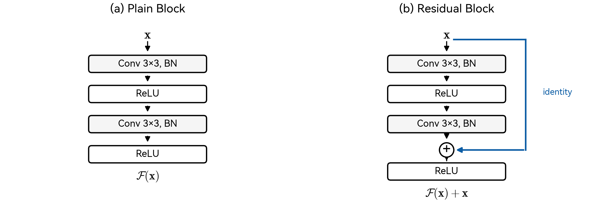
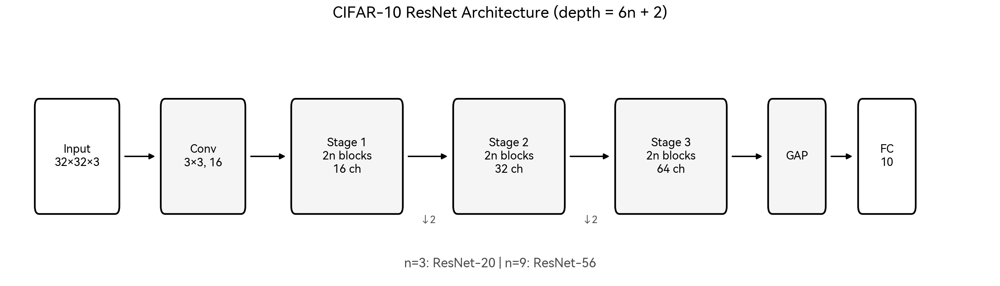

# 深度残差网络图像分类研究

## ——基于 CIFAR-10 数据集的 ResNet 论文复现

---

**摘要**：深度卷积神经网络在图像分类任务中取得了显著成功，然而随着网络深度的增加，训练难度急剧上升，甚至出现性能退化（degradation）现象。He 等人于 2016 年提出的深度残差网络（ResNet）通过引入恒等映射捷径连接，有效解决了深层网络的优化困难问题。本文在 CIFAR-10 数据集上复现了原论文的核心实验，构建了 Plain-20/56 与 ResNet-20/56 四组对照网络，系统验证了 degradation 现象的存在性及残差学习的有效性。实验结果表明：56 层 Plain 网络的测试准确率（87.69%）显著低于 20 层 Plain 网络（91.27%），证实了深层网络的退化现象；而 ResNet-56 的测试准确率达到 93.58%，不仅优于同深度的 Plain 网络，也优于浅层的 ResNet-20（91.44%），验证了残差连接能够有效改善深层网络的可训练性。

**关键词**：深度学习；残差网络；图像分类；CIFAR-10；degradation

---

# 目录

- 第一章 绪论
- 第二章 深度残差网络原理
- 第三章 实验设计与实现
- 第四章 实验结果与分析
- 第五章 结论
- 参考文献

---

# 第一章 绪论

## 1.1 研究背景与意义

图像分类是计算机视觉领域的基础任务之一，其目标是将输入图像正确归类到预定义的语义类别中。近年来，深度卷积神经网络（Deep Convolutional Neural Networks, DCNNs）在该任务上取得了突破性进展，其核心优势在于能够通过多层非线性变换自动学习从低级纹理到高级语义的层次化特征表示。

理论研究表明，网络深度是影响模型表达能力的关键因素。从函数逼近的角度，深层网络相比浅层网络能够以指数级更少的参数表示复杂函数。这一理论发现推动了研究者不断探索更深的网络结构。然而，实践中发现：当网络深度超过一定阈值后，模型性能不升反降。这种现象被称为"退化问题"（degradation problem），其本质并非过拟合——因为深层网络在训练集上的误差同样高于浅层网络。退化问题的存在表明，深层网络的优化存在本质困难，阻碍了深度优势的充分发挥。

针对上述问题，He 等人[1]于 2016 年在 CVPR 会议上提出了深度残差网络（Deep Residual Network, ResNet）。该方法通过引入"捷径连接"（shortcut connection）构建残差学习框架，使网络层学习输入与输出之间的残差映射而非直接映射，从而显著降低了优化难度。ResNet 在 ImageNet 大规模视觉识别挑战赛（ILSVRC 2015）中以 152 层的深度取得了分类任务冠军，top-5 错误率仅为 3.57%，首次超越人类水平。该工作不仅解决了深层网络训练的核心难题，更开创了"通过结构设计改善优化"的研究范式，对后续深度学习架构的发展产生了深远影响。

本文的研究目标是在 CIFAR-10 数据集上复现 ResNet 原论文的核心实验，通过严格的对照实验验证以下两个关键论断：（1）深层 Plain 网络存在退化现象；（2）残差连接能够有效缓解该问题。复现工作的意义不仅在于验证经典结论的可重复性，更在于通过亲手实现加深对残差学习机制的理解。

## 1.2 卷积神经网络发展综述

### 1.2.1 LeNet：卷积神经网络的开端

卷积神经网络的概念最早可追溯至 LeCun 等人[2]于 1998 年提出的 LeNet-5。该网络针对手写数字识别任务设计，包含两个卷积层、两个池化层和三个全连接层，总深度约 7 层。LeNet-5 首次将卷积操作、权值共享和空间下采样等概念系统地整合到神经网络中，奠定了现代 CNN 的基本框架。其核心设计思想包括：

- **局部感受野**：每个神经元仅与输入的局部区域连接，符合视觉信息的局部相关性特点
- **权值共享**：同一特征图内所有神经元共享卷积核参数，大幅减少模型参数量
- **空间下采样**：通过池化操作逐步降低特征图分辨率，增强特征的平移不变性

受限于当时的计算能力和数据规模，LeNet 的应用范围主要局限于小规模任务。

### 1.2.2 AlexNet：深度学习的复兴

2012 年，Krizhevsky 等人[3]提出的 AlexNet 在 ImageNet 图像分类竞赛中以显著优势夺冠，top-5 错误率从前一年的 26.2% 骤降至 15.3%，标志着深度学习时代的正式开启。AlexNet 的网络结构包含 5 个卷积层和 3 个全连接层，相比 LeNet 显著加深。其成功的关键因素包括：

**网络结构创新**：
- 采用 ReLU（Rectified Linear Unit）激活函数替代传统的 Sigmoid/Tanh，有效缓解梯度消失问题，加速网络收敛
- 使用重叠池化（overlapping pooling），即池化窗口大小大于步长，轻微提升模型性能
- 引入局部响应归一化（Local Response Normalization, LRN），模拟生物神经系统的侧抑制机制

**训练技术突破**：
- 利用双 GPU 并行训练，突破单卡显存限制
- 采用 Dropout 正则化技术，随机丢弃 50% 的全连接层神经元，有效抑制过拟合
- 使用数据增强（随机裁剪、水平翻转、颜色抖动）扩充训练样本

AlexNet 的成功证明了大规模数据与 GPU 算力支撑下，深层 CNN 具有强大的特征学习能力。

### 1.2.3 VGGNet：深度的价值

Simonyan 和 Zisserman[4]于 2014 年提出的 VGGNet 系统地研究了网络深度对性能的影响。VGGNet 的核心设计理念是"简洁而深"：全网络仅使用 3×3 小卷积核堆叠，通过增加网络深度（从 11 层到 19 层）来提升模型容量。

**3×3 卷积核的优势**：
- 两个 3×3 卷积层的感受野等效于一个 5×5 卷积层，三个 3×3 卷积层等效于一个 7×7 卷积层
- 相同感受野下，小卷积核堆叠的参数量更少（如 $3 \times 3^2 = 27$ vs $7^2 = 49$）
- 更多的非线性激活层增强了网络的表达能力

VGGNet-16 和 VGGNet-19 在 ILSVRC 2014 分类任务中分别取得亚军和季军。该工作的重要贡献在于验证了"深度是提升性能的有效途径"这一假设，为后续更深网络的探索奠定了基础。然而，VGG 系列网络参数量庞大（VGG-16 约 1.38 亿参数），计算代价较高。

### 1.2.4 GoogLeNet/Inception：宽度与多尺度

与 VGGNet 追求深度不同，Szegedy 等人[5]于 2014 年提出的 GoogLeNet（Inception v1）探索了网络宽度维度的设计空间。GoogLeNet 的核心创新是 Inception 模块，该模块在同一层级并行执行多种尺度的卷积操作（1×1、3×3、5×5）和池化操作，然后将输出在通道维度上拼接。

**Inception 模块的设计动机**：
- 图像中的目标尺度变化较大，单一尺度的卷积核难以有效捕获多尺度信息
- 通过多分支结构自适应地选择最优感受野大小
- 使用 1×1 卷积进行通道降维，在扩展宽度的同时控制计算量

GoogLeNet 以仅 500 万参数（VGG-16 的 1/27）的轻量级设计，在 ILSVRC 2014 分类任务中夺得冠军。该工作表明，精心设计的网络结构可以在性能与效率之间取得更好的平衡。

### 1.2.5 批量归一化：训练的稳定剂

Ioffe 和 Szegedy[6]于 2015 年提出的批量归一化（Batch Normalization, BN）技术是深度学习训练方法的重要突破。BN 的核心操作是对每个 mini-batch 内的激活值进行归一化处理：

$$\hat{x}_i = \frac{x_i - \mu_B}{\sqrt{\sigma_B^2 + \epsilon}}$$

$$y_i = \gamma \hat{x}_i + \beta$$

其中 $\mu_B$ 和 $\sigma_B^2$ 分别为 mini-batch 的均值和方差，$\gamma$ 和 $\beta$ 为可学习的缩放和平移参数。

**BN 的主要优势**：
- **加速收敛**：归一化后的激活值分布更稳定，允许使用更大的学习率
- **降低初始化敏感性**：减少网络对参数初始化方式的依赖
- **正则化效果**：mini-batch 统计量的随机性引入了轻微的噪声，具有一定的正则化作用

BN 的引入使得训练更深的网络成为可能，已成为现代深度网络的标准组件。然而，即便配合 BN，当网络深度进一步增加时，退化问题仍然存在。

### 1.2.6 退化问题的本质

退化问题（degradation problem）是指随着网络深度增加，模型准确率先饱和后下降的现象。值得强调的是，这种性能下降并非由过拟合导致——深层网络在训练集上的误差同样高于浅层网络。

从理论上分析，深层网络的解空间包含浅层网络的解空间。假设存在一个性能优良的浅层网络，我们可以构造一个与之等效的深层网络：让新增的层学习恒等映射。因此，深层网络的训练误差理论上不应高于浅层网络。然而，实验观察表明标准优化算法（如 SGD）难以在深层网络中找到这样的解。

退化问题的根本原因在于：深层网络的误差曲面（error surface）更加复杂，存在大量的鞍点和局部极小值；同时，梯度在反向传播过程中经过多层链式相乘，容易出现衰减或爆炸。这些因素共同导致优化算法难以收敛到理想的解。

ResNet 正是针对退化问题提出的结构性解决方案。

## 1.3 本文研究内容

本文的核心工作是在 CIFAR-10 数据集上复现 ResNet 原论文的对照实验，具体包括：

1. **模型实现**：从零构建 Plain Network 和 ResNet 两类网络结构，支持 20 层和 56 层两种深度配置
2. **对照实验设计**：严格控制数据增强、优化器、学习率策略等变量，确保性能差异仅来源于网络结构
3. **现象验证**：通过训练曲线和测试精度验证 degradation 现象的存在及残差连接的改善效果
4. **结果可视化**：绘制训练 loss 曲线、测试准确率曲线等，直观展示实验结论

---

# 第二章 深度残差网络原理

## 2.1 残差学习框架

### 2.1.1 问题的重新表述

设 $\mathcal{H}(\mathbf{x})$ 为若干堆叠层需要拟合的目标映射，其中 $\mathbf{x}$ 为输入。传统的直接学习方式要求网络层直接逼近 $\mathcal{H}(\mathbf{x})$，这在深层网络中被证明是困难的。

残差学习的核心思想是改变学习目标：不再直接学习 $\mathcal{H}(\mathbf{x})$，而是学习残差函数：

$$\mathcal{F}(\mathbf{x}) := \mathcal{H}(\mathbf{x}) - \mathbf{x}$$

则原始映射可重写为：

$$\mathcal{H}(\mathbf{x}) = \mathcal{F}(\mathbf{x}) + \mathbf{x}$$

这一重新表述的关键假设是：如果恒等映射是最优的（即 $\mathcal{H}(\mathbf{x}) = \mathbf{x}$），那么将残差 $\mathcal{F}(\mathbf{x})$ 推向零比直接学习恒等映射更容易。直观上，对于一个已经良好初始化的网络，当最优映射接近恒等时，残差分支只需输出接近零的小扰动。

### 2.1.2 残差块的结构

残差块（Residual Block）是 ResNet 的基本构成单元。对于 CIFAR-10 数据集，本文采用基本残差块（Basic Block）设计，其结构如图 2-1 所示。

**图 2-1** Plain Block 与 Residual Block 结构对比。左图为传统的直接堆叠结构；右图为残差结构，新增了恒等捷径连接（identity shortcut）。

残差块的前向传播可形式化表示为：

$$\mathbf{y} = \mathcal{F}(\mathbf{x}, \{W_i\}) + \mathbf{x}$$

其中：
- $\mathbf{x}$ 和 $\mathbf{y}$ 分别为块的输入和输出向量
- $\mathcal{F}(\mathbf{x}, \{W_i\})$ 表示残差映射，由两个 3×3 卷积层及其配套的 BN 和 ReLU 组成
- 加法运算为逐元素相加，要求 $\mathcal{F}$ 和 $\mathbf{x}$ 的维度相同

当输入输出维度不匹配时（如发生下采样或通道数变化），需要对捷径连接进行投影：

$$\mathbf{y} = \mathcal{F}(\mathbf{x}, \{W_i\}) + W_s \mathbf{x}$$

原论文提出两种维度匹配策略：
- **Option A（零填充）**：空间维度通过跨步采样降低，通道维度通过零填充扩展，不引入额外参数
- **Option B（投影）**：使用 1×1 卷积将输入投影到目标维度

本文实验默认采用 Option A，以保持与原论文 CIFAR 实验的一致性。

### 2.1.3 残差学习的优化优势

残差结构之所以能够缓解深层网络的优化困难，可从以下角度理解：

**1. 恒等映射易于实现**

当最优映射接近恒等时，残差分支只需学习接近零的映射。由于网络参数通常初始化为接近零的小值，残差分支天然倾向于输出零，这使得恒等映射成为一个容易到达的基准解。而在 Plain 网络中，直接通过多层非线性变换逼近恒等映射并非易事。

**2. 梯度传播路径缩短**

考虑损失函数 $\mathcal{L}$ 对输入 $\mathbf{x}$ 的梯度。对于残差结构：

$$\frac{\partial \mathcal{L}}{\partial \mathbf{x}} = \frac{\partial \mathcal{L}}{\partial \mathbf{y}} \cdot \frac{\partial \mathbf{y}}{\partial \mathbf{x}} = \frac{\partial \mathcal{L}}{\partial \mathbf{y}} \cdot \left(1 + \frac{\partial \mathcal{F}}{\partial \mathbf{x}}\right)$$

梯度中的恒等项"1"提供了一条无衰减的梯度传播路径，使得梯度能够直接回传到浅层，有效缓解了深层网络的梯度消失问题。

**3. 误差曲面更平滑**

研究表明，残差网络的损失函数曲面比 Plain 网络更加平滑，具有更好的凸性，使优化算法更容易找到全局最优解。

## 2.2 CIFAR-10 网络结构

### 2.2.1 整体架构

针对 CIFAR-10 的 32×32 小尺寸输入，原论文设计了专用的网络结构。与 ImageNet 版本不同，CIFAR 版本不使用复杂的 stem 模块和最大池化层。网络整体架构如图 2-2 所示。

**图 2-2** CIFAR-10 ResNet 网络架构。网络由一个卷积层、三个 stage 和一个全连接分类器组成。每个 stage 包含 2n 个残差块，n 取值决定网络深度。

网络结构的具体配置如表 2-1 所示。

**表 2-1** CIFAR-10 ResNet 网络结构配置

| 阶段 | 输出尺寸 | 结构 |
|:---:|:---:|:---|
| conv1 | 32×32 | 3×3, 16, stride 1 |
| stage1 | 32×32 | $\begin{bmatrix} 3×3, 16 \\ 3×3, 16 \end{bmatrix} \times n$ |
| stage2 | 16×16 | $\begin{bmatrix} 3×3, 32 \\ 3×3, 32 \end{bmatrix} \times n$ |
| stage3 | 8×8 | $\begin{bmatrix} 3×3, 64 \\ 3×3, 64 \end{bmatrix} \times n$ |
| pool | 1×1 | global average pooling |
| fc | 10 | fully connected, softmax |

网络总层数为 $6n + 2$（包括初始卷积层和最终全连接层）。本文实验选取 $n = 3$（ResNet-20）和 $n = 9$（ResNet-56）两种配置。

### 2.2.2 参数量分析

各模型的参数量统计如表 2-2 所示。

**表 2-2** 模型参数量对比

| 模型 | 深度 | 参数量 |
|:---:|:---:|---:|
| Plain-20 | 20 | 269.7K |
| Plain-56 | 56 | 853.0K |
| ResNet-20 | 20 | 269.7K |
| ResNet-56 | 56 | 853.0K |

由于 Option A 的捷径连接不引入额外参数，相同深度的 Plain 网络与 ResNet 参数量完全相同。这确保了对照实验中模型容量的一致性，性能差异仅来源于结构设计。

## 2.3 损失函数与优化目标

本文采用交叉熵损失函数作为优化目标。对于单个样本，设 $\mathbf{p} = (p_1, \ldots, p_C)$ 为模型预测的类别概率分布（经 Softmax 归一化），$\mathbf{y} = (y_1, \ldots, y_C)$ 为真实标签的 one-hot 编码，则交叉熵损失定义为：

$$\mathcal{L}_{CE} = -\sum_{c=1}^{C} y_c \log(p_c)$$

对于单标签分类任务，上式简化为 $\mathcal{L}_{CE} = -\log(p_k)$，其中 $k$ 为真实类别索引。

---

# 第三章 实验设计与实现

## 3.1 实验环境

本文实验在以下软硬件环境中完成。

**表 3-1** 实验环境配置

| 项目 | 配置 |
|:---|:---|
| 操作系统 | Arch Linux (kernel 6.17.9) |
| CPU | Intel Core i7-12650H (10 cores) |
| 内存 | 24 GB DDR4 |
| GPU | NVIDIA GeForce RTX 4060 Laptop (8 GB VRAM) |
| 深度学习框架 | PyTorch 2.9.1 |
| CUDA 版本 | 13.0 |
| Python 版本 | 3.12.12 |
| 包管理工具 | pixi |

## 3.2 数据集与预处理

### 3.2.1 CIFAR-10 数据集

CIFAR-10[7]是广泛使用的小规模图像分类基准数据集，由 Alex Krizhevsky 于 2009 年收集整理。数据集的基本信息如表 3-2 所示。

**表 3-2** CIFAR-10 数据集统计

| 属性 | 值 |
|:---|:---|
| 图像尺寸 | 32 × 32 × 3 (RGB) |
| 类别数量 | 10 |
| 训练集样本数 | 50,000 |
| 测试集样本数 | 10,000 |
| 每类训练样本 | 5,000 |
| 每类测试样本 | 1,000 |

10 个类别分别为：飞机（airplane）、汽车（automobile）、鸟（bird）、猫（cat）、鹿（deer）、狗（dog）、青蛙（frog）、马（horse）、船（ship）和卡车（truck）。

### 3.2.2 数据增强策略

为提升模型泛化能力并与原论文保持一致，训练阶段采用以下数据增强策略：

1. **随机裁剪（Random Crop）**：对图像四周进行 4 像素零填充，然后随机裁剪回 32×32 尺寸，引入平移不变性
2. **随机水平翻转（Random Horizontal Flip）**：以 50% 概率对图像进行水平镜像翻转

测试阶段不进行任何数据增强，仅执行归一化操作。

### 3.2.3 数据归一化

所有图像（训练和测试）均进行通道归一化处理，使用 CIFAR-10 训练集的统计量：

$$\text{mean} = (0.4914, 0.4822, 0.4465)$$
$$\text{std} = (0.2470, 0.2435, 0.2616)$$

归一化后，各通道数据近似服从标准正态分布，有利于网络训练的稳定性。

## 3.3 模型实现

### 3.3.1 基础模块

本文实现了统一的 BasicBlock 模块，通过 `use_shortcut` 参数控制是否启用捷径连接，从而在同一代码框架下构建 Plain 网络和 ResNet。

核心实现位于 `src/models/resnet_cifar.py`，主要包含：
- `BasicBlock`：基本残差块，支持 identity shortcut 和 projection shortcut
- `PlainCifarNet`：无捷径连接的 Plain 网络
- `ResNetCifar`：带捷径连接的残差网络

### 3.3.2 参数初始化

卷积层权重采用 Kaiming 初始化[8]，使用 fan_out 模式：

$$W \sim \mathcal{N}\left(0, \sqrt{\frac{2}{n_{out}}}\right)$$

其中 $n_{out}$ 为输出通道数。fan_out 模式在反向传播时保持梯度方差稳定，这对于深层网络的训练尤为重要。该初始化方法专为 ReLU 激活函数设计。

BatchNorm 层的 $\gamma$ 参数初始化为 1，$\beta$ 参数初始化为 0。

## 3.4 训练配置

### 3.4.1 优化器设置

本文采用带动量的随机梯度下降（SGD with Momentum）优化器，配置如下：

**表 3-3** 优化器超参数配置

| 参数 | 值 | 说明 |
|:---|:---|:---|
| 初始学习率 | 0.1 | 原论文推荐值 |
| 动量系数 | 0.9 | 加速收敛、平滑梯度 |
| 权重衰减 | $1 \times 10^{-4}$ | L2 正则化系数 |
| Nesterov 动量 | 否 | 保持与原论文一致 |

### 3.4.2 学习率调度

采用阶梯式学习率衰减策略（MultiStepLR），在固定的 epoch 节点将学习率乘以衰减因子：

$$\eta_t = \eta_0 \times \gamma^{\sum_{m \in M} \mathbb{1}(t \geq m)}$$

其中 $\eta_0 = 0.1$ 为初始学习率，$\gamma = 0.1$ 为衰减因子，$M = \{100, 150\}$ 为衰减节点。

具体地：
- Epoch 1-100：$\eta = 0.1$
- Epoch 101-150：$\eta = 0.01$
- Epoch 151-200：$\eta = 0.001$

学习率变化曲线如图 3-1 所示。

**图 3-1** 学习率调度曲线。采用 MultiStepLR 策略，在 epoch 100 和 150 处分别衰减 10 倍。

### 3.4.3 训练超参数汇总

**表 3-4** 训练超参数汇总（本次复现 vs 原论文）

| 参数 | 本次复现 | 原论文 (CIFAR) |
|:---|:---:|:---:|
| Batch Size | 128 | 128 |
| 总 Epoch 数 | 200 | 约 64K iterations (≈200 epochs) |
| 初始学习率 | 0.1 | 0.1 |
| 学习率衰减节点 | [100, 150] | [32K, 48K] iterations |
| 衰减因子 | 0.1 | 0.1 |
| 动量 | 0.9 | 0.9 |
| 权重衰减 | $1 \times 10^{-4}$ | $1 \times 10^{-4}$ |
| 数据增强 | Crop + Flip | Crop + Flip |

本文采用的训练配置与原论文高度一致，确保实验结果的可比性。

## 3.5 实验流程

### 3.5.1 对照实验设计

为验证退化现象和残差连接的有效性，本文设计了 2×2 的因子实验：

**表 3-5** 对照实验设计

| 实验组 | 网络结构 | 深度 | 目的 |
|:---:|:---:|:---:|:---|
| Plain-20 | Plain | 20 | 基准（浅层无残差） |
| Plain-56 | Plain | 56 | 验证退化现象 |
| ResNet-20 | ResNet | 20 | 基准（浅层有残差） |
| ResNet-56 | ResNet | 56 | 验证残差改善效果 |

四组实验使用完全相同的训练配置（数据集、预处理、优化器、学习率策略等），仅网络结构不同，以确保性能差异仅来源于结构因素。

### 3.5.2 评估指标

- **训练损失（Train Loss）**：每个 epoch 在训练集上的平均交叉熵损失
- **测试准确率（Test Accuracy）**：每个 epoch 在测试集上的分类准确率
- **最佳测试准确率（Best Test Acc）**：200 个 epoch 内的最高测试准确率

---

# 第四章 实验结果与分析

## 4.1 实验概况

本次复现实验的运行标识为 `repro-20251218-140032`，四组模型均完成 200 个 epoch 的完整训练。训练产物存储于 `experiments/resnet/reproduction/repro-20251218-140032/` 目录。

## 4.2 定量结果

### 4.2.1 最终性能对比

**表 4-1** 四组模型性能对比

| 模型 | 最佳测试准确率 | 最终测试准确率 (Epoch 200) | 最终训练损失 |
|:---:|:---:|:---:|:---:|
| Plain-20 | **91.27%** | 91.16% | 0.0250 |
| Plain-56 | 87.69% | 87.23% | 0.1607 |
| ResNet-20 | 91.44% | 91.26% | 0.0180 |
| ResNet-56 | **93.58%** | 93.43% | 0.0030 |

### 4.2.2 关键观察

**观察 1：深层 Plain 网络出现退化**

Plain-56 的最佳测试准确率（87.69%）显著低于 Plain-20（91.27%），差距达 3.58 个百分点。这一结果直接证实了退化现象的存在：更深的 Plain 网络不仅没有带来性能提升，反而导致了明显的性能下降。

**观察 2：退化并非过拟合**

Plain-56 的最终训练损失（0.1607）远高于 Plain-20（0.0250），表明深层网络在训练集上也未能充分拟合。这排除了过拟合的可能性，说明退化问题源于优化困难。

**观察 3：残差连接显著改善深层网络性能**

ResNet-56 的最佳测试准确率（93.58%）不仅远超同深度的 Plain-56（+5.89 pp），也优于浅层的 ResNet-20（+2.14 pp）。这表明残差连接不仅解决了退化问题，还使深层网络能够从增加的深度中获益。

**观察 4：残差网络训练更充分**

ResNet-56 的最终训练损失（0.0030）极低，接近于零，说明网络能够很好地拟合训练数据。这与 Plain-56 的高训练损失形成鲜明对比。

## 4.3 训练曲线分析

### 4.3.1 训练损失曲线

**图 4-1** 四组模型的训练损失曲线。Plain-56 的损失在整个训练过程中始终高于其他模型，且下降速度较慢；ResNet-56 的损失下降最快且最终值最低。

从图 4-1 可以观察到：

1. **Plain-56 的训练损失显著高于 Plain-20**：在 epoch 100 之前，Plain-56 的损失约为 Plain-20 的 2-3 倍，且差距在训练后期并未缩小。这直观地展示了深层 Plain 网络的优化困难。

2. **学习率衰减带来损失骤降**：所有模型在 epoch 100 和 150 处（学习率衰减节点）均出现损失的快速下降，但幅度各异。ResNet 系列的响应更为显著。

3. **ResNet-56 收敛最充分**：ResNet-56 的最终训练损失趋近于零，表明其优化过程最为顺利。

### 4.3.2 测试准确率曲线

**图 4-2** 四组模型的测试准确率曲线。ResNet-56 在训练全程保持最高准确率；Plain-56 的准确率始终最低。

从图 4-2 可以观察到：

1. **退化现象的直观呈现**：Plain-56 的测试准确率曲线始终位于 Plain-20 下方，且差距在训练后期趋于稳定（约 4 个百分点）。这是退化现象在测试集上的直接体现。

2. **残差连接的改善效果**：ResNet-56 的曲线始终位于最上方，且与 Plain-56 的差距非常显著（约 6 个百分点）。即便在早期 epoch，ResNet-56 也展现出明显的优势。

3. **深层残差网络的优势**：ResNet-56 不仅优于 Plain 网络，也稳定优于 ResNet-20，证明了残差结构能够有效利用增加的深度。

## 4.4 与原论文的对比

**表 4-2** 本文复现结果与原论文对比

| 模型 | 本文复现 (%) | 原论文报告 (%) | 差距 |
|:---:|:---:|:---:|:---:|
| Plain-20 | 91.27 | — | — |
| Plain-56 | 87.69 | — | — |
| ResNet-20 | 91.44 | 91.25 | +0.19 |
| ResNet-56 | 93.58 | 93.03 | +0.55 |

注：原论文 Table 6 仅报告 ResNet 系列的错误率（error rate），未给出 Plain 网络的具体数值。Plain 网络的退化现象仅在 Figure 1 和 Figure 6 中以训练/测试曲线形式展示，明确显示 Plain-56 的 error 高于 Plain-20。本文 ResNet 复现结果与原论文高度一致（原论文 ResNet-20 error rate 8.75% 即准确率 91.25%，ResNet-56 error rate 6.97% 即准确率 93.03%）。

本文复现结果与原论文高度一致，部分指标略有提升，可能源于以下因素：
- PyTorch 与 Caffe 的实现差异
- 随机种子和硬件环境的影响
- BN 层的实现细节（如运行时统计量的更新方式）

复现结果充分验证了原论文结论的可重复性。

## 4.5 讨论：为什么残差学习有效

基于实验观察，可以从以下角度理解残差学习的有效性：

### 4.5.1 优化视角

残差结构将学习目标从 $\mathcal{H}(\mathbf{x})$ 转变为 $\mathcal{F}(\mathbf{x}) = \mathcal{H}(\mathbf{x}) - \mathbf{x}$。当最优映射接近恒等时，优化算法只需将残差分支推向零——这比直接学习恒等映射容易得多。实验中 ResNet-56 极低的训练损失（0.0030）表明优化过程非常顺利。

### 4.5.2 梯度流视角

捷径连接提供了一条"梯度高速公路"，使梯度信号能够无衰减地回传到浅层。这有效缓解了深层网络的梯度消失问题，使得 56 层网络的优化不再比 20 层网络困难多少。

### 4.5.3 集成学习视角

研究表明，ResNet 可以看作多条不同深度路径的隐式集成。捷径连接使得信息可以通过不同长度的路径传播，增强了模型的表达能力和鲁棒性。

---

# 第五章 结论

## 5.1 研究总结

本文在 CIFAR-10 数据集上成功复现了 ResNet 原论文的核心对照实验，得出以下主要结论：

1. **退化现象真实存在**：56 层 Plain 网络的测试准确率（87.69%）显著低于 20 层 Plain 网络（91.27%），且其训练损失也更高。这证实了深层网络的退化问题源于优化困难而非过拟合。

2. **残差连接有效解决退化问题**：ResNet-56 的测试准确率达到 93.58%，比 Plain-56 高出 5.89 个百分点，比 Plain-20 高出 2.31 个百分点。残差结构使深层网络能够充分发挥深度优势。

3. **复现结果与原论文一致**：本文的实验结果与原论文报告的数据高度吻合，验证了结论的可重复性。

## 5.2 研究意义

本次复现工作的意义不仅在于验证经典结论，更在于：

- **深化理论理解**：通过亲手实现和实验，加深了对残差学习机制的理解
- **掌握实验方法**：学习了严格的对照实验设计和训练配置管理
- **积累工程经验**：熟悉了 PyTorch 框架下深度学习模型的构建、训练和评估流程

## 5.3 展望

基于本文的工作，未来可进一步探索：

- 在更大规模数据集（如 ImageNet）上验证残差学习的效果
- 研究不同深度、不同 shortcut 类型（Option A vs B）的影响
- 将残差思想应用于其他任务（如目标检测、语义分割）

---

# 参考文献

[1] He K, Zhang X, Ren S, et al. Deep residual learning for image recognition[C]//Proceedings of the IEEE Conference on Computer Vision and Pattern Recognition. 2016: 770-778.

[2] LeCun Y, Bottou L, Bengio Y, et al. Gradient-based learning applied to document recognition[J]. Proceedings of the IEEE, 1998, 86(11): 2278-2324.

[3] Krizhevsky A, Sutskever I, Hinton G E. ImageNet classification with deep convolutional neural networks[C]//Advances in Neural Information Processing Systems. 2012: 1097-1105.

[4] Simonyan K, Zisserman A. Very deep convolutional networks for large-scale image recognition[C]//International Conference on Learning Representations. 2015.

[5] Szegedy C, Liu W, Jia Y, et al. Going deeper with convolutions[C]//Proceedings of the IEEE Conference on Computer Vision and Pattern Recognition. 2015: 1-9.

[6] Ioffe S, Szegedy C. Batch normalization: Accelerating deep network training by reducing internal covariate shift[C]//International Conference on Machine Learning. 2015: 448-456.

[7] Krizhevsky A. Learning multiple layers of features from tiny images[R]. Technical Report, University of Toronto, 2009.

[8] He K, Zhang X, Ren S, et al. Delving deep into rectifiers: Surpassing human-level performance on ImageNet classification[C]//Proceedings of the IEEE International Conference on Computer Vision. 2015: 1026-1034.

